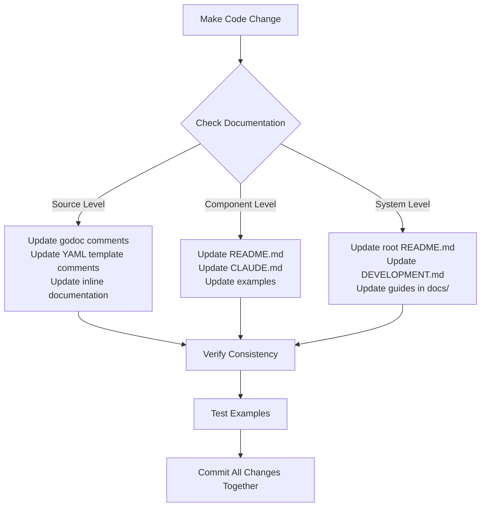

# CloudZero Agent - AI Development Guide

## Critical Principle: Use the Documentation

**This project is extensively documented.** When you don't know how to do something, start with the documentation, then verify against source code. You have access to both - use them together. The better you maintain the documentation as you work, the more valuable it becomes for future development.

The CloudZero Agent is a complex, multi-component Kubernetes integration system with multiple Go applications, extensive testing infrastructure, and comprehensive documentation. This guide helps you navigate and maintain that documentation system.

## Documentation Architecture

### Hierarchical Organization

Documentation is organized in **layers of increasing specificity** as you descend the directory tree:

```text
root/                           # Project-wide documentation
├── README.md                   # Overview, components, message formats
├── DEVELOPMENT.md              # Build system, testing, deployment
├── CONTRIBUTING.md             # Contribution standards
├── CLAUDE.md                   # This file - AI navigation guide
│
├── app/                        # Go application code
│   ├── README.md              # Application architecture (hexagonal pattern)
│   ├── CLAUDE.md              # AI-specific development guidance
│   ├── domain/                # Business logic layer
│   │   └── README.md          # Domain patterns and usage
│   ├── functions/             # CLI applications
│   │   ├── collector/
│   │   │   └── README.md      # Collector-specific docs
│   │   └── webhook/
│   │       └── README.md      # Webhook-specific docs
│   └── types/                 # Core interfaces
│       └── README.md          # Interface contracts
│
├── helm/                       # Kubernetes deployment
│   ├── README.md              # Chart structure
│   ├── templates/             # Extensively commented YAML
│   ├── docs/                  # Operational guides
│   │   ├── troubleshooting-guide.md
│   │   └── cert-trouble-shooting.md
│   └── tests/                 # Helm unit tests (standard location)
│
├── tests/                      # Most tests live here
│   ├── README.md              # Testing philosophy and methodology
│   ├── helm/                  # Helm integration tests
│   │   ├── README.md          # Helm testing strategies
│   │   └── templates/         # Local test overrides (gitignored)
│   ├── kuttl/                 # Kubernetes integration tests
│   │   └── README.md          # KUTTL framework usage
│   └── integration/           # API integration tests
│       └── README.md          # Integration test patterns
│
├── clusters/                   # Multi-cluster deployment configs
│   └── README.md              # Cluster configuration system
│
└── docs/                       # Additional documentation
    └── testing/               # Testing guides
```

### Key Documentation Locations

**Source Code Documentation:**

- **Go files**: Fully documented with go doc comments
- **Helm templates**: Extensive YAML comments explaining logic
- **Makefile**: Commented targets and functions

**Markdown Documentation:**

- **Root level**: Project-wide concerns ([README.md](README.md), [DEVELOPMENT.md](DEVELOPMENT.md), [CONTRIBUTING.md](CONTRIBUTING.md))
- **Component level**: Architecture and usage (app/README.md, helm/README.md)
- **Subdirectory level**: Specific implementations (app/domain/README.md, tests/kuttl/README.md)

## Essential Development Practices

### 1. Test-Driven Development

**MANDATORY**: Every development task must follow a test-driven approach:

**Core principles:**

1. **Write tests first** - Define expected behavior before implementation
2. **Add tests incrementally** - Create tests for each new feature or bug fix
3. **Test at all levels** - Unit, integration, Helm, and end-to-end
4. **Use tests for debugging** - When issues arise, add tests to reproduce and verify fixes

**Test coverage requirements:**

- **Go code**: Unit tests with `gomock` for isolation, table-driven tests for scenarios
- **Helm charts**: Unit tests (helm-unittest), schema validation, template tests, KUTTL e2e tests
- **Integration**: API tests, smoke tests, complete workflow tests
- **Quality over quantity**: Target >90% coverage with meaningful tests

### 2. Always Use the Makefile

**DO NOT run tools directly.** The Makefile ensures consistent tool versions, proper flags, and dependency handling:

```sh
# ✅ CORRECT - Use Makefile targets
make -j format lint test build
make test GO_TEST_TARGET=./app/domain
make generate

# ❌ WRONG - Direct tool invocation
go test ./...
go generate
golangci-lint run
```

**Why Make is required:**

- Ensures consistent tool versions and flags
- Handles dependencies and generated files correctly
- Provides parallelism with `-j` flag
- Integrates with project's build system properly

**Parallelization**: Use `-j` flag for parallel execution - the Makefile is designed for this:

```sh
make -j test-all              # Run all tests in parallel
make -j format lint analyze   # Multiple targets in parallel
```

### 3. Leverage the Cluster Configuration System

The `clusters/` directory provides a powerful multi-cluster deployment system:

```sh
# Deploy to specific cluster
CLUSTER_NAME=my-cluster make helm-install helm-wait

# Use KIND for local development (default)
make helm-install helm-wait

# Uninstall from cluster
CLUSTER_NAME=my-cluster make helm-uninstall
```

**Add your own clusters**: Create `clusters/my-cluster.yaml` and `clusters/my-cluster-overrides.yaml` (gitignored by default)

### 4. Use Local Override Files for Testing

The `tests/helm/templates/` directory gitignores files matching `local-*.yaml`:

```sh
# Create local test configuration
cat > tests/helm/templates/local-test-overrides.yaml <<EOF
components:
  collector:
    replicas: 3
EOF

# Generate manifest with overrides
make tests/helm/templates/local-test.yaml

# Diff against default to see from default installation
diff -u tests/helm/templates/manifest.yaml tests/helm/templates/local-test-manifest.yaml
```

This is an extremely powerful tool for understanding how configuration affects output.

### 5. Research Before Implementing

**When you don't know something:**

1. **Check the relevant README** - Start at the appropriate level (component, subdirectory)
2. **Review CLAUDE.md files** - AI-specific guidance in relevant directories
3. **Review README.md and other markdown files** - There is extensive documentation in markdown files in the tree
4. **Read the source code** - Extensively commented with go doc comments and inline docs
5. **Check DEVELOPMENT.md** - Build system, testing, and workflow patterns
6. **Examine Makefile targets** - Many capabilities are built into the Makefile

**Component READMEs often document:**

- How to run tests for that specific component
- Useful Makefile variables (e.g., `GO_TEST_TARGET`, `GO_TEST_FLAGS`)
- Component-specific testing tricks and configurations
- Common debugging approaches

**Example Research Path for Adding a New Feature:**

```text
1. app/README.md           → Understand hexagonal architecture
2. app/types/README.md     → Review interface contracts
3. Similar component code  → See established patterns
4. DEVELOPMENT.md          → Understand testing requirements
5. Implement following patterns
```

## Documentation Maintenance Protocol

**CRITICAL**: When making changes, documentation must be updated synchronously to avoid publishing outdated information.

### Change Impact Assessment

For every code change, check documentation at all relevant levels:



### Documentation Update Checklist

Before committing changes:

- [ ] Updated godoc comments if function behavior changed
- [ ] Updated YAML template comments if Helm logic changed
- [ ] Updated component README if architecture/usage changed
- [ ] Updated examples if interfaces changed
- [ ] Verified examples execute successfully
- [ ] Checked root README for outdated information
- [ ] Updated DEVELOPMENT.md if build/test workflows changed

### Bubble-Up Review Process

When making changes, **bubble up through the directory tree** checking documentation at each level:

1. **Start at implementation** - Update godoc/inline comments
2. **Check subdirectory** - Update component README/CLAUDE.md
3. **Check parent directory** - Update broader documentation
4. **Check root** - Update project-wide documentation if needed

## Project Structure Overview

The repository produces a **Helm Chart** (`helm/`) that is mirrored to github.com/Cloudzero/cloudzero-charts - this is the primary user-facing artifact. Everything else serves development, testing, and build infrastructure:

```text
root/
├── app/                        # All Go application code
│   ├── domain/                # Business logic (hexagonal architecture core)
│   ├── functions/             # CLI applications (collector, shipper, webhook, validator)
│   ├── types/                 # Core interfaces and contracts
│   ├── handlers/              # HTTP and request handlers
│   ├── storage/               # Data persistence layer
│   └── utils/                 # Shared utilities
│
├── helm/                       # Kubernetes deployment (USER-FACING)
│   ├── templates/             # Extensively commented K8s manifests
│   ├── tests/                 # Helm unit tests (standard Helm location)
│   └── docs/                  # Operational guides and troubleshooting
│
├── tests/                      # Comprehensive testing infrastructure
│   ├── integration/           # API integration tests
│   ├── helm/                  # Helm integration tests
│   │   └── templates/         # Test configurations (gitignored local-*.yaml)
│   ├── kuttl/                 # Kubernetes end-to-end tests
│   ├── smoke/                 # Production validation
│   └── load/                  # Performance testing
│
├── clusters/                   # Multi-cluster deployment configurations
├── docker/                     # Container build definitions
├── docs/                       # Additional documentation
├── scripts/                    # Build and utility scripts
└── .tools/                     # Development tool dependencies
```

Note that unit tests co-located with Go source as \*\_test.go files.

### Testing Philosophy

This project has **extensive testing infrastructure** covering multiple layers:

- **Unit tests**: Co-located with Go source files
- **Integration tests**: `tests/integration/` - API integration
- **Helm tests**: `helm/tests/` (unit) and `tests/helm/` (integration)
- **Kubernetes tests**: `tests/kuttl/` - End-to-end cluster testing
- **Smoke tests**: `tests/smoke/` - Production validation
- **Load tests**: `tests/load/` - Performance testing

To run all tests: `make -j test-all`. **WARNING**: this is very slow, like > 10 minutes. Because it does a _lot_.

See `tests/README.md` for comprehensive testing methodology.

## Navigation by Task Type

### Adding/Modifying Go Code

1. `app/README.md` - Architecture overview
2. `app/types/README.md` - Interface contracts
3. Component-specific README - Detailed patterns
4. Source code - See existing implementations
5. `DEVELOPMENT.md` - Testing requirements

### Helm Chart Development

1. `helm/README.md` - Chart structure
2. `helm/docs/` - Operational guides
3. `tests/helm/README.md` - Testing strategies
4. Helm template comments - Inline documentation
5. `DEVELOPMENT.md` - Build workflows

### Debugging/Troubleshooting

1. `helm/docs/troubleshooting-guide.md` - Common issues
2. `helm/docs/cert-trouble-shooting.md` - Certificate issues
3. Component README files - Behavior documentation
4. `DEVELOPMENT.md` - Build and deployment

### Testing

1. **Check component README first** - Many directories document how to test that component
2. `tests/README.md` - Testing philosophy
3. Test type-specific README - Detailed guidance (e.g., `tests/kuttl/README.md`)
4. `DEVELOPMENT.md` - Test execution commands
5. Component README - Component testing patterns and useful tricks

## Key Reminders

1. **This project is extremely well-documented** - Research before guessing
2. **Always use Makefile targets** - Never run tools directly
3. **Use `-j` for parallel execution** - Everything is designed for this
4. **Leverage cluster configurations** - Easy multi-cluster deployment
5. **Use local override files** - Powerful testing tool in `tests/helm/templates/`
6. **Maintain documentation consistency** - Update all levels when making changes
7. **Follow established patterns** - Consistency is critical in complex systems
8. **Trust the inline documentation** - Godoc and YAML comments are comprehensive

## Quick Reference

```sh
# Essential development cycle
make -j format lint test build

# Comprehensive testing (WARNING: slow, > 10 minutes)
make -j test-all

# Targeted testing (very useful - check component READMEs for more tricks)
GO_TEST_TARGET=./app/domain make test                   # Test specific package
GO_TEST_TARGET=./app/functions/collector make test      # Test collector only
GO_TEST_FLAGS="-v -run TestSpecificFunction" make test  # Specific test

# Specific test categories
make test              # Go unit tests
make test-integration  # API integration tests
make test-smoke        # Smoke tests
make helm-test         # All Helm validation tests
make helm-test-kuttl   # Kubernetes end-to-end tests

# Helm operations
make helm-lint                             # Lint Helm chart
make helm-install helm-wait                # Deploy and wait for ready
CLUSTER_NAME=my-cluster make helm-install  # Deploy to custom cluster
make helm-uninstall                        # Remove from cluster

# Full workflow (creates cluster, tests, cleans up)
make kind-test  # Complete KIND testing workflow

# Cleanup
make clean      # Remove build artifacts
make kind-down  # Delete KIND cluster

# Tools and help
make install-tools  # Install development dependencies
make help           # List all available targets
```

## Remember

**You have access to extensive documentation and source code.** Start with the documentation to understand the system, then verify your understanding against the source. The documentation exists at multiple levels - use the hierarchical structure to find what you need, and keep it up-to-date as you make changes. The more accurately you maintain it, the more valuable it becomes.
