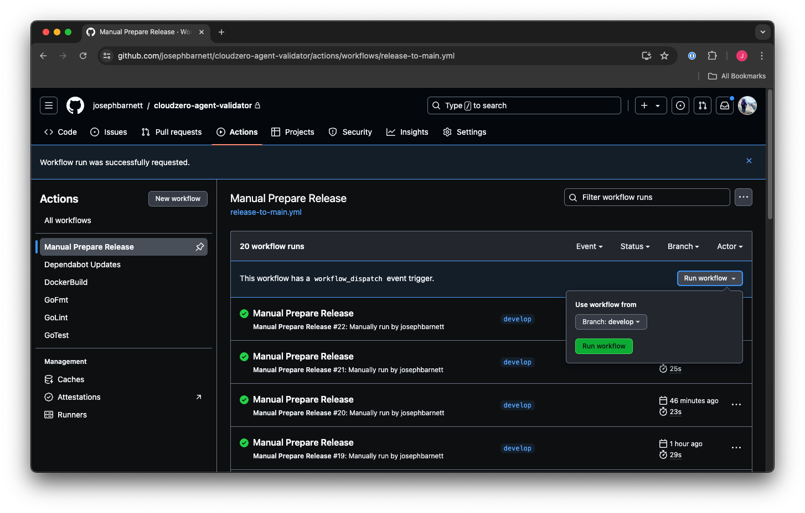
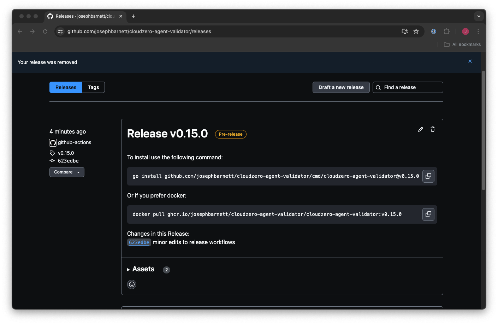
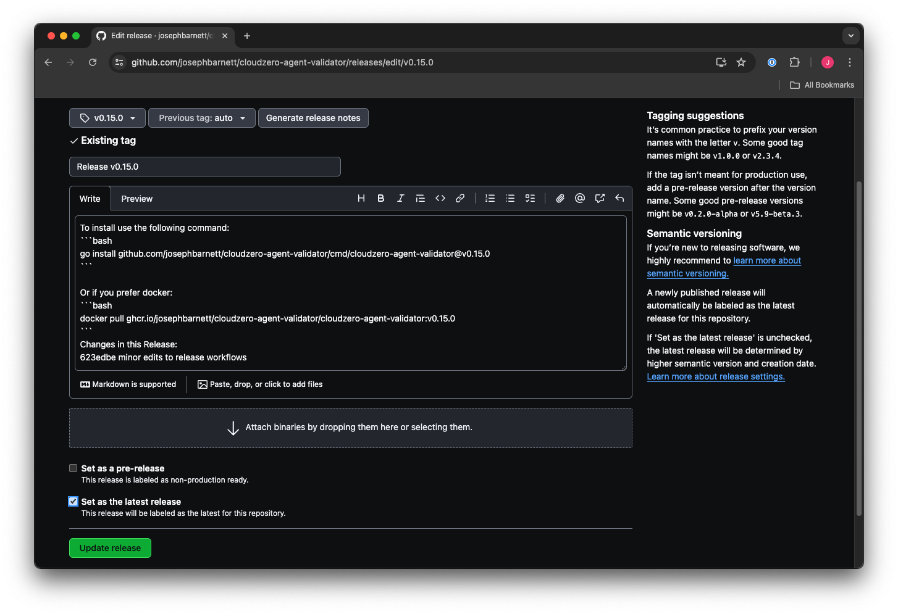

# CloudZero Agent Development Guide

## Prerequisites

Before getting started with CloudZero Agent development, make sure you have the following prerequisites installed on your system:

### System Dependencies (Required)

For most development tasks, you need:

- Standard Unix tools: `awk`, `grep`, `sed`, `xargs`, etc.
- [Go](https://go.dev/doc/install)
- [Docker](https://docs.docker.com/engine/install/) - Container runtime
- [kubectl](https://kubernetes.io/docs/tasks/tools/) - Kubernetes CLI
- [npm](https://docs.npmjs.com/downloading-and-installing-node-js-and-npm) - For various linters, formatters, and documentation tools
- [curl](https://curl.se/) - HTTP client

### Additional Dependencies (Optional)

- [Protocol buffer compiler (protoc)](https://developers.google.com/protocol-buffers) version 3 - Only needed for `make maintainer-clean` (protobuf files are checked into repository)
- [Github Actions Utility (act)](https://github.com/nektos/act) - For local CI/CD testing
- [checkov](https://www.checkov.io/) - Infrastructure security scanning

### Managed Dependencies

Many tools are automatically installed via `make install-tools`, including: Helm, Kind, golangci-lint, gofumpt, staticcheck, dyff, kubeconform, kuttl, mockgen, prettier, mmdc, ...

**Note**: Go protocol buffer plugins are installed automatically via `make install-tools` - no manual installation required.

## Development Quick Start

To quickly get started with CloudZero Agent development, follow these steps:

### 1. Repository Setup

1. Clone the repository:

   ```sh
   git clone https://github.com/Cloudzero/cloudzero-agent.git
   ```

2. Change to the project directory:

   ```sh
   cd cloudzero-agent
   ```

### 2. Building the Code

1. Install the project dependencies:

   ```sh
   go mod download
   make install-tools
   ```

2. Build the binary:

   ```sh
   make build
   ```

### 3. Local Testing

The CloudZero Agent has multiple layers of testing that mirror what runs in CI. Always use Make targets rather than running commands directly.

**Essential development workflow:**

```sh
# Run all tests (includes Go unit tests, Helm tests, integration tests, and kind cluster tests)
make -j test-all

# Alternative: format and lint separately, then test everything
make -j format lint analyze build test-all
```

**Parallelization**: The `-j` flag can be used with most Make targets to significantly speed up builds and tests by running tasks in parallel. This is especially beneficial on multi-core development machines.

**What `test-all` includes:**

- `helm-test` - All Helm chart validation tests
- `test` - Go unit tests
- `test-integration` - API integration tests (requires `CLOUDZERO_DEV_API_KEY`)
- `kind-test` - Complete Kind cluster workflow (create cluster, install chart, run KUTTL tests, cleanup)
- `test-smoke` - Smoke tests (requires `CLOUDZERO_DEV_API_KEY`)

> **Note**: Some tests in `test-all` require API keys or will create/destroy Kind clusters. For faster development cycles, you can run individual test categories as needed.

#### Test Categories

**Go Application Testing:**

```sh
make test                                    # All Go unit tests
make test GO_TEST_TARGET=./app/functions/... # Specific package tests
make lint                                    # Go linting (golangci-lint)
make format                                  # Go formatting (gofumpt)
```

**Helm Chart Testing:**

```sh
make helm-test                    # All Helm validation tests
make helm-test-schema             # Values schema validation
make helm-test-template           # Template rendering validation
make helm-test-unittest           # Helm unit tests
make helm-test-subchart           # Subchart validation
make helm-test-kuttl              # Integration tests (requires cluster)
```

**Integration Testing:**

```sh
make test-integration             # API integration tests
make test-smoke                   # Smoke tests
make test-ci                      # All CI test suites locally
```

**Security & Quality:**

```sh
make analyze                      # Static analysis
make analyze-checkov              # Infrastructure security scanning
```

#### File Requirements

- All files must end with a newline character
- No trailing whitespace on any line
- Use `make format` for consistent formatting across all file types

#### Component-Specific Testing

For detailed testing guidance on individual components, see:

- `app/functions/*/README.md` - Component-specific test patterns
- `tests/README.md` - Integration test documentation
- `helm/docs/` - Helm chart testing details

### Testing Alloy Integration

The chart supports both Prometheus and Grafana Alloy as metrics collectors. To test Alloy, first enable it in your cluster overrides file (`clusters/*-overrides.yaml`):

```yaml
defaults:
  federation:
    alloy: true
```

Then deploy:

```sh
CLUSTER_NAME=my-cluster make helm-install helm-wait
```

For detailed Alloy documentation, see:

- `helm/docs/alloy-migration-guide.md` - Migration from Prometheus
- `helm/docs/troubleshooting-guide.md` - Alloy-specific troubleshooting

### Updating prometheus-config-reloader

The `prometheus-config-reloader` binary is built from upstream source during the
image build (see the `reloader` stage in `docker/Dockerfile`) and shipped inside
the agent image, rather than pulled as a separate external image. The chart runs
it both as the Prometheus reload sidecar and, in federated mode, as the
`config-subst` init container that substitutes `$(NODE_NAME)` into the Prometheus
config (it uses Thanos-style `$(VAR)` syntax, so Prometheus relabel
back-references like `${1}` are left untouched).

The version is pinned by the `RELOADER_VERSION` build arg in `docker/Dockerfile`.
**This is a git tag, which Dependabot does not track** (it only watches
`Chart.yaml` and Dockerfile `FROM` lines), so it must be bumped by hand:

1. Pick a new tag from
   <https://github.com/prometheus-operator/prometheus-operator/releases>.
2. Update `RELOADER_VERSION` in `docker/Dockerfile`.
3. Rebuild and run the image scan (`grype`, see `.github/workflows/scan-images.yml`).
   If new High/Critical CVEs appear in transitive dependencies, bump them in the
   `reloader` stage's `go get` line (currently `golang.org/x/crypto` and
   `golang.org/x/net`). These are carried slightly ahead of upstream's pins; drop
   the override once upstream pins versions at least as new.

## Go Development Patterns

### Package Organization

**Application Structure:**

- **Main packages**: `app/functions/` - Individual CLI applications and services
- **Business logic**: `app/domain/` - Core business logic, dependency-injection friendly
- **Common utilities**: `app/utils/` - Shared utilities across applications
- **Type definitions**: `app/types/` - Centralized interfaces and types
- **Configuration**: `app/config/` - Configuration management and validation

### Code Conventions

**Error Handling:**

```go
result, err := someFunction()
if err != nil {
    return fmt.Errorf("descriptive context: %w", err)
}
```

**Configuration:**

- Uses `cleanenv` for environment variable binding
- Struct tags for JSON/YAML/ENV binding with validation

**HTTP Patterns:**

- `go-chi/chi` router with structured middleware
- Handler organization in `app/handlers/` with `Register()` and `Routes()` methods
- Custom Kubernetes metrics API v1beta1 implementation

**Testing Conventions:**

- `testify` for assertions and test organization
- `go.uber.org/mock` for mock generation
- Table-driven tests with both positive and negative cases
- Use `*_test.go` naming convention

### Build Integration

**Go Generate Pattern:**

```go
//go:generate make -C ../../.. target-name
```

**Tool Binary Naming:**

- `app/functions/helmless/` → `bin/cloudzero-helmless`
- `app/functions/agent-validator/` → `bin/cloudzero-agent-validator`

## Project Structure

**Core Applications** (`app/functions/`):

- `collector/` - Prometheus metrics collection
- `shipper/` - S3 upload orchestration
- `webhook/` - Kubernetes admission controller
- `agent-validator/` - Deployment validation

**Key Directories**:

- `app/domain/` - Business logic
- `app/config/` - Configuration management
- `app/storage/` - Storage abstractions
- `app/types/` - Type definitions
- `helm/` - Kubernetes deployment charts (mirrored to github.com/cloud0/cloud0-charts)
- `tests/` - Integration and system tests
- `clusters/` - Multi-cluster deployment configurations

**Build Outputs**:

- `bin/cloudzero-*` - Compiled binaries
- Generated files are in `.gitignore`

## Multi-Cluster Development

The project supports deployment to multiple Kubernetes clusters using a unified configuration system:

**Deployment commands:**

```sh
# Deploy to specific cluster
CLUSTER_NAME=my-cluster make helm-install helm-wait

# Uninstall from cluster
CLUSTER_NAME=my-cluster make helm-uninstall

# Use kind for local development
CLUSTER_NAME=kind make helm-install helm-wait
```

Cluster configurations are stored in the `clusters/` directory with separate files for cluster connection details and override values.

**Note**: The helm subdirectory is mirrored to github.com/cloud0/cloud0-charts and doesn't have full Makefile integration. For helm-specific development workflows, see the documentation in the helm directory.

---

# Release Process

Publishing a new release can be accomplished by running the `Manual Prepare Release` workflow.



**Once run the following occurs:**

1. _All changes on the `develop` branch_ are merged into the `main` branch.
2. A new semver `tag` is created.
3. A new `pre-release` is created, with the `change log` for changes since the last release.

Next we can visit the release page, and locate the `pre-release` and `click the edit icon`:


Finally - we will publish the `draft-release`. Make sure you:

1. Remove the `draft` checkbox
2. Update _`Set as pre-release`_ to **`Set as the latest release`**



When this is done, it will cause an automated release of the `docker image` for the release value, and `latest` to be created in GHCR.

That's it, Happy coding!
