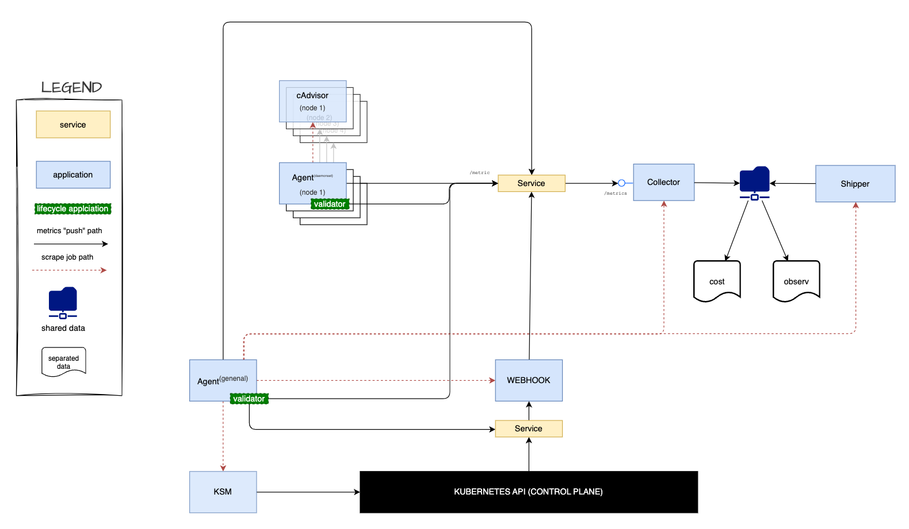
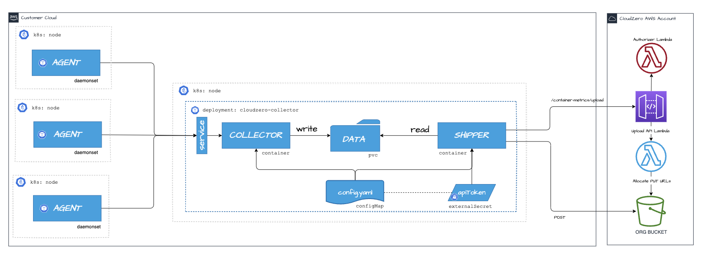

# CloudZero Agent - The Captain's Log

[](CODE-OF-CONDUCT.md)
[](LICENSE)




Ahoy! This here treasure trove o' code contains several mighty applications to support Kubernetes integration
with the CloudZero platform, includin':

- _CloudZero Insights Controller_ - This here scallywag provides telemetry to the CloudZero platform, enablin' complex cost allocation and analysis like a true treasure hunter. This webhook application securely receives resource provisionin' and deprovisionin' requests from the Kubernetes API, like a proper quartermaster keepin' track o' the ship's supplies. It collects resource labels, annotations, and relationship metadata between resources, ultimately supportin' the identification of CSP resources not directly connected to a Kubernetes node - like findin' hidden treasure on distant islands!

- _CloudZero Collector_ - The collector application which implements a prometheus compliant interface for metrics collection, like a proper ship's log keeper. It writes the metrics payloads to files in a shared location for consumption by the shipper, like stowin' treasure in the hold. Today the collector classifies incomin' metrics data, and will save the data into either cost telemetry files, or into observability files. These files are compressed on disk to save space - like packin' treasure chests efficiently!

- _CloudZero Shipper_ - The shipper application monitors shared locations for metrics file creation, like a lookout watchin' for incoming ships. It allocates pre-signed S3 PUT URLs for customers (usin' the `CloudZero upload API`), and then uploads data to the AWS S3 bucket at set intervals, like sendin' messages in bottles across the seven seas. This approach protects against invalid API keys and enables end-to-end file trackin' - like havin' a proper chain of custody for yer treasure!

- _CloudZero Agent Validator_ - The validator application is part of the agent's pod lifecycle hooks, like a ship's surgeon checkin' the crew's health. It is responsible for performin' basic validation checks, and notifyin' the CloudZero platform of installation status changes (initializin', started, stoppin'). This application runs during the lifecycle hook, then exits when complete - like a proper inspection before settin' sail!

> Note the **_agent application_** which is responsible for executin' metrics scrape jobs at various intervals, like a diligent crew member performin' their duties. The agent will communicate with a kube-state-metrics exporter application, and cAdvisor exporter applications (one per machine instance). For large scale clusters, the agent runs in "federated mode" (aka daemonset mode), where each instance on each machine is responsible for metrics collection on that single machine - like havin' a crew member on each ship in yer fleet!

## ⚡ Hoistin' the Sails with CloudZero Insights Controller

The easiest way to set sail with the _CloudZero Insights Controller_ is by
usin' the `cloudzero-agent` Helm chart from the [cloudzero-charts
repository](https://github.com/Cloudzero/cloudzero-charts) - like followin' a proper treasure map!

### Installation

See the [Installation Guide](./INSTALL.md) for details, ye landlubber!

### Configuration

See the [Configuration Guide](./CONFIGURATION.md) for details, matey!

###### Cleanup

```sh
make undeploy-admission-controller
make undeploy-test-app
```

### Debugging

The applications are based on a scratch container, so no shell be available - like a ship without a proper galley! The
container images are less than 8MB - lighter than a feather!

To monitor the data directory, ye must deploy a `debug` container as follows:

1. **Deploy a debug container**

   ```bash
   kubectl apply  -f cluster/deployments/debug/deployment.yaml
   ```

2. **Attach to the shell of the debug container**

   ```bash
   kubectl exec -it temp-shell -- /bin/sh
   ```

   To inspect the data directory, `cd /cloudzero/data` - like explorin' the ship's hold!

---

### **Clean Up**

```bash
eksctl delete cluster -f cluster/cluster.yaml --disable-nodegroup-eviction
```

## Collector & Shipper Architecture - The Ship's Operations



This here project provides a collector application, written in golang, which provides two mighty applications:

- `Collector` - The collector application exposes a prometheus remote write API
  which can receive POST requests from prometheus in either v1 or v2 encoded
  format, like receivin' messages from other ships at sea! It decodes the messages, then writes them to the `data` directory as
  Brotri-compressed JSON - like packin' treasure in waterproof chests!
- `Shipper` - The shipper application watches the data directory lookin' for
  completed parquet files on a regular interval (eg. 10 min), like a diligent lookout scanin' the horizon! Then it will call the
  `CloudZero upload API` to allocate S3 Presigned PUT URLS. These URLs are used
  to upload the file, like gettin' permission to dock at a port. The application has the ability to compress the files
  before sendin' them to S3 - like packin' yer cargo efficiently before shippin'!

## Message Format - The Captain's Code

The output of the _CloudZero Insights Controller_ application is a JSON object
that represents `cloudzero` metrics, which is POSTed to the CloudZero remote
write API, like sendin' a message in a bottle across the seven seas! The format of these objects is based on the Prometheus `Timeseries`
protobuf message, defined
[here](https://github.com/prometheus/prometheus/blob/main/prompb/types.proto#L122-L130).
Protobuf definitions for the `cloudzero` metrics are in the `proto/` directory - like the ship's code book!

There be four kinds of objects that can be sent:

1. **Pod metrics** - Like trackin' each crew member on the ship!

### Metric Names - The Ship's Manifest

- `cloudzero_pod_labels` - Like the crew member's name tags!
- `cloudzero_pod_annotations` - Like the crew member's personal notes!

### Required Fields - The Captain's Requirements

- `__name__`; will be one of the valid pod metric names - like the crew member's proper name!
- `namespace`; the namespace that the pod is launched in - like which deck they work on!
- `resource_type`; will always be `pod` for pod metrics - like markin' them as crew!

<details open>
<summary>Example</summary>

```json
{
  "labels": [
    {
      "name": "__name__",
      "value": "cloudzero_pod_labels"
    },
    {
      "name": "namespace",
      "value": "default"
    },
    {
      "name": "pod",
      "value": "hello-28889630-955wd"
    },
    {
      "name": "resource_type",
      "value": "pod"
    },
    {
      "name": "label_batch.kubernetes.io/controller-uid",
      "value": "cc52c38d-b461-40ab-a65d-2d5a68ac08e5"
    },
    {
      "name": "label_batch.kubernetes.io/job-name",
      "value": "hello-28889630"
    },
    {
      "name": "label_controller-uid",
      "value": "cc52c38d-b461-40ab-a65d-2d5a68ac08e5"
    },
    {
      "name": "label_job-name",
      "value": "hello-28889630"
    }
  ],
  "samples": [
    {
      "value": 1.0,
      "timestamp": "1733378003953"
    }
  ]
}
```

</details>

2. **Workload Metrics** - Like trackin' the different types of ships in yer fleet!

### Metric Names - The Fleet's Manifest

- `cloudzero_deployment_labels` - Like the flagship's nameplate!
- `cloudzero_deployment_annotations` - Like the flagship's captain's notes!
- `cloudzero_statefulset_labels` - Like the merchant ship's nameplate!
- `cloudzero_statefulset_annotations` - Like the merchant ship's captain's notes!
- `cloudzero_daemonset_labels` - Like the patrol ship's nameplate!
- `cloudzero_daemonset_annotations` - Like the patrol ship's captain's notes!
- `cloudzero_job_labels` - Like the mission ship's nameplate!
- `cloudzero_job_annotations` - Like the mission ship's captain's notes!
- `cloudzero_cronjob_labels` - Like the scheduled ship's nameplate!
- `cloudzero_cronjob_annotations` - Like the scheduled ship's captain's notes!

### Required Fields - The Fleet Master's Requirements

- `__name__`; will be one of the valid workload metric names - like the ship's proper name!
- `namespace`; the namespace that the workload is launched in - like which port they sail from!
- `workload`; the name of the workload - like the ship's call sign!
- `resource_type`; will be one of `deployment`, `statefulset`, `daemonset`,
  `job`, or `cronjob` - like the type of vessel!

<details open>
<summary>Example</summary>

```json
{
  "labels": [
    {
      "name": "__name__",
      "value": "cloudzero_deployment_labels"
    },
    {
      "name": "namespace",
      "value": "default"
    },
    {
      "name": "workload",
      "value": "hello"
    },
    {
      "name": "resource_type",
      "value": "deployment"
    },
    {
      "name": "label_component",
      "value": "greeting"
    },
    {
      "name": "label_foo",
      "value": "bar"
    }
  ],
  "samples": [
    {
      "value": 1.0,
      "timestamp": "1733378003953"
    }
  ]
}
```

</details>

3.  **Namespace Metrics** - Like trackin' the different ports and harbors!

### Metric Names - The Port Master's Log

- `cloudzero_namespace_labels` - Like the port's official nameplate!
- `cloudzero_namespace_annotations` - Like the port master's notes!

### Required Fields - The Port Master's Requirements

- `__name__`; will be one of the valid namespace metric names - like the port's proper name!
- `namespace`; the name of the namespace - like which port we're talkin' about!
- `resource_type`; will always be `namespace` for namespace metrics - like markin' it as a port!

<details open>
<summary>Example</summary>

```json
{
  "labels": [
    {
      "name": "__name__",
      "value": "cloudzero_namespace_labels"
    },
    {
      "name": "namespace",
      "value": "default"
    },
    {
      "name": "resource_type",
      "value": "namespace"
    },
    {
      "name": "label_engr.os.com/component",
      "value": "foo"
    },
    {
      "name": "label_kubernetes.io/metadata.name",
      "value": "default"
    }
  ],
  "samples": [
    {
      "value": 1.0,
      "timestamp": "1733880410225"
    }
  ]
}
```

</details>

4.  **Node Metrics** - Like trackin' the different islands and landmasses!

### Metric Names - The Cartographer's Log

- `cloudzero_node_labels` - Like the island's official nameplate!
- `cloudzero_node_annotations` - Like the cartographer's notes!

### Required Fields - The Cartographer's Requirements

- `__name__`; will be one of the valid node metric names - like the island's proper name!
- `node`; the name of the node - like which island we're chartin'!
- `resource_type`; will always be `node` for node metrics - like markin' it as land!

<details open>
<summary>Example</summary>

```json
{
  "labels": [
    {
      "name": "__name__",
      "value": "cloudzero_node_labels"
    },
    {
      "name": "resource_type",
      "value": "node"
    },
    {
      "name": "label_alpha.eksctl.io/nodegroup-name",
      "value": "spot-nodes"
    },
    {
      "name": "label_beta.kubernetes.io/arch",
      "value": "amd64"
    }
  ],
  "samples": [
    {
      "value": 1.0,
      "timestamp": "1733880410225"
    }
  ]
}
```

</details>

## 🤝 How to Join the Crew

We appreciate feedback and contribution to this here treasure trove! Before ye set sail,
please see the followin':

- [This repo's contribution guide](CONTRIBUTING.md) - Like the ship's articles!

## 🤔 Support + Feedback - The Captain's Quarters

Contact support@cloudzero.com for usage, questions, specific cases, matey! See the
[CloudZero Docs](https://docs.cloudzero.com/) for general information on
CloudZero - like consultin' the ship's library!

## 🛡️ Vulnerability Reporting - Security Matters

Please do not report security vulnerabilities on the public GitHub issue
tracker, ye scallywag! Email [security@cloudzero.com](mailto:security@cloudzero.com) instead - like sendin' a private message to the captain!

## ☁️ What be CloudZero? - The Treasure Map

CloudZero be the only cloud cost intelligence platform that puts engineering in
control by connectin' technical decisions to business results, like havin' a proper navigator on yer ship!:

- [Cost Allocation And Tagging](https://www.cloudzero.com/tour/allocation)
  Organize and allocate cloud spend in new ways, increase taggin' coverage, or
  work on showback - like properly cataloguin' yer treasure!
- [Kubernetes Cost Visibility](https://www.cloudzero.com/tour/kubernetes)
  Understand yer Kubernetes spend alongside total spend across containerized
  and non-containerized environments - like trackin' all the ships in yer fleet!
- [FinOps And Financial Reporting](https://www.cloudzero.com/tour/finops)
  Operationalize reportin' on metrics such as cost per customer, COGS, gross
  margin. Forecast spend, reconcile invoices and easily investigate variance - like keepin' proper ship's accounts!
- [Engineering Accountability](https://www.cloudzero.com/tour/engineering)
  Foster a cost-conscious culture, where engineers understand spend, proactively
  consider cost, and get immediate feedback with fewer interruptions and faster
  and more efficient innovation - like trainin' yer crew to be cost-conscious sailors!
- [Optimization And Reducing Waste](https://www.cloudzero.com/tour/optimization)
  Focus on immediately reducin' spend by understandin' where we have waste,
  inefficiencies, and discountin' opportunities - like findin' ways to make yer ship more efficient!

Learn more about [CloudZero](https://www.cloudzero.com/) on our website
[www.cloudzero.com](https://www.cloudzero.com/) - like consultin' the captain's charts!

## 📜 License - The Ship's Articles

This project be licensed under the Apache 2.0 [LICENSE](LICENSE) - like the ship's official charter!
