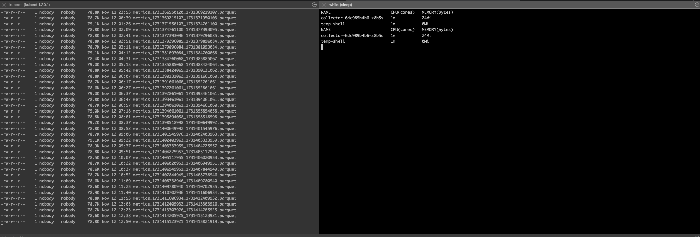

# Application Architecture


This project provides a collector application, written in golang, which provides two applications:

* `Collector` - the collector application exposes a prometheus remote write API which can receive POST requests from prometheus in either v1 or v2 encoded format. It decodes the messages, then writes them to the `data` directory as parquet files with snappy compression.
* `Shipper` - the shipper application watches the data directory looking for completed parquet files on a regular interval (eg. 10 min), then will call the `CloudZero upload API` to allocate S3 Presigned PUT URLS. These URLs are used to upload the file. The application has the ability to compress the files before sending them to S3.

The data is stored on a persistent volume to allow for application restarts, so no data is ever lost.

Additionally, both applications are designed to allow for horizontal scaling behind a Service interface.

In testing on a small cluster, the avarage memory us of the applications was below 25MB, while an overnight run showed only 5MB of disk usage.



---

## DEPLOY QUICK START

You may want to modify the parameters in the file:

* app/manifests/cloudzero/config.yaml - this file has the configuration for the deployment
* app/manifests/cloudzero/secret.yaml - this file has the CloudZero API secret

### 1. Build and Package the application

```
make package
```

### 2. Deploy Collector Application Set
```
kubectl apply  -f app/manifests/cloudzero/namespace.yml \
               -f app/manifests/cloudzero/secret.yml \
               -f app/manifests/cloudzero/config.yaml \
               -f app/manifests/cloudzero/pvc.yaml \
               -f app/manifests/cloudzero/deployment.yml
```

### 3. Deploy Federated Cloudzero Agent
```
kubectl apply  -f app/manifests/prometheus-federated/deployment.yml
```

---
## Testing

1. There are `unit tests` included in the project.
2. Additionally the applications can be build, and debugged locally. (`make build`)
3. Use the `test/sendfiles.sh` to send a metrics payload to the collector "remote write" API
4. Use the `test/dumpfile.sh` to decode and dump the parquet files (verify will be usable on our AWS side)
---

## Debugging

The applications are based on a scratch container, so no shell is available. The container images are less than 8MB.

To monitor the data directory, you must deploy a `debug` container as follows:

```
kubectl apply  -f app/manifests/cloudzero/cdebug.yaml
```

Next you can access it using the following:
```
kubectl exec -it temp-shell -n cirrus -- /bin/sh
```

To inspect the data directory, `cd /cloudzero/data`