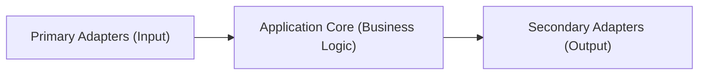

# CloudZero Agent - Application Root

## Documentation Structure

This project uses **hierarchical CLAUDE.md files** to provide structured codebase navigation:

- **Each directory** has a CLAUDE.md explaining its purpose, contents, and testing
- **Follow the hierarchy** - start here, then navigate to subdirectory CLAUDE.md files for details
- **Comprehensive documentation** - The codebase has extensive inline comments, README files, Mermaid diagrams, and architectural documentation
- **Use all available information** - Read source code comments, type definitions, test files, and documentation together for complete understanding

**CRITICAL: All documentation must be kept up-to-date when making code changes.**

## Architecture

CloudZero Agent implements hexagonal (ports and adapters) architecture for cost allocation and monitoring of Kubernetes clusters.



## Directory Structure

### Application Core

- **[types/](./types/CLAUDE.md)** - Interfaces, types, errors (contracts)
- **[domain/](./domain/CLAUDE.md)** - Pure business logic

### Primary Adapters (Input)

- **[handlers/](./handlers/CLAUDE.md)** - HTTP endpoints (Prometheus remote_write, webhooks)
- **[functions/](./functions/CLAUDE.md)** - CLI applications

### Secondary Adapters (Output)

- **[storage/](./storage/CLAUDE.md)** - Data persistence (SQLite, disk)

### Supporting Infrastructure

- **[logging/](./logging/)** - Structured logging
- **[http/](./http/)** - HTTP utilities
- **[utils/](./utils/)** - Common utilities
- **[config/](./config/)** - Configuration management
- **[inspector/](./inspector/)** - Diagnostics

## Testing

```sh
# Unit tests for app directory
GO_TEST_TARGET=./app/... make test

# Integration and smoke tests (require API credentials)
make test-integration
make test-smoke

# Build container images for testing
make docker-build

# Complete testing workflow
make test-all
```

## Key Principles

1. **Interfaces first** - Define contracts before implementation
2. **Domain purity** - Business logic has no I/O dependencies
3. **Dependency injection** - Adapters injected into domain services
4. **Fail-open design** - Never block Kubernetes operations
5. **Test-driven development** - Write tests first, then implementation

## Hexagonal Architecture (Ports and Adapters)

CloudZero Agent follows hexagonal architecture for clean separation of concerns and testability.

### Core Concepts

**Hexagonal architecture** creates loosely coupled components:

1. **Application Core** (`domain/`) - Pure business logic, no infrastructure dependencies
2. **Ports** (`types/`) - Abstract interfaces defining communication protocols
3. **Adapters** - Implementations connecting ports to external systems

**Primary Adapters (Input):**

- `handlers/` - HTTP adapters (Prometheus remote_write, custom metrics API)
- `functions/` - CLI adapters (collector, shipper, webhook, validator)

**Secondary Adapters (Output):**

- `storage/` - Persistence adapters (SQLite, disk with Brotli compression)

### Example: Metric Collection

```go
// Port (types/) - Abstract interface
type WritableStore interface {
    Put(context.Context, ...Metric) error
    Flush() error
    Pending() int
}

// Domain Service (domain/) - Pure business logic
type MetricCollector struct {
    costStore    types.WritableStore  // Port dependency
    clock        types.TimeProvider   // Port dependency
}

func (d *MetricCollector) PutMetrics(ctx context.Context, data []byte) error {
    // Pure business logic - filtering, validation, categorization
    costMetrics, obsMetrics := d.filter.Filter(metrics)
    return d.costStore.Put(ctx, costMetrics...)
}

// Adapter (storage/) - Concrete implementation
type DiskStore struct {
    dirPath string
}

func (d *DiskStore) Put(ctx context.Context, metrics ...types.Metric) error {
    // Infrastructure concern - file I/O, compression
}

// Wiring (functions/collector/main.go)
func main() {
    costStore := disk.NewDiskStore(settings.Database, clock, "cost")
    collector := domain.NewMetricCollector(settings, clock, costStore)
    handler := handlers.NewRemoteWriteAPI("/collector", collector)
}
```

**Benefits:**

- **Testability** - Mock ports to test business logic in isolation
- **Technology independence** - Swap storage/HTTP implementations without changing domain
- **Deployment flexibility** - Same core runs as collector, shipper, or webhook

## Go Development Practices

### Test-Driven Development

**MANDATORY**: Every Go change requires tests first.

```go
// Write test first
func TestMetricCollector_FiltersCostMetrics(t *testing.T) {
    ctrl := gomock.NewController(t)
    defer ctrl.Finish()

    mockStore := mocks.NewMockWritableStore(ctrl)
    mockStore.EXPECT().Put(gomock.Any(), gomock.Any()).Return(nil)

    collector := domain.NewMetricCollector(settings, mockClock, mockStore)
    err := collector.PutMetrics(ctx, testData)

    assert.NoError(t, err)
}

// Then implement
func (d *MetricCollector) PutMetrics(ctx context.Context, data []byte) error {
    // Implementation
}
```

### Table-Driven Tests

Use table-driven tests for comprehensive coverage:

```go
func TestFunction(t *testing.T) {
    tests := []struct {
        name     string
        input    InputType
        expected OutputType
        wantErr  bool
    }{
        {
            name:     "handles empty input",
            input:    InputType{},
            expected: OutputType{},
        },
        {
            name:    "returns error on invalid data",
            input:   invalidInput,
            wantErr: true,
        },
    }

    for _, tt := range tests {
        t.Run(tt.name, func(t *testing.T) {
            result, err := Function(tt.input)

            if tt.wantErr {
                assert.Error(t, err)
                return
            }

            assert.NoError(t, err)
            if diff := cmp.Diff(result, tt.expected); diff != "" {
                t.Errorf("mismatch (-want +got):\n%s", diff)
            }
        })
    }
}
```

### Mock Testing Patterns

**Never called scenario:**

```go
func TestOptionalOperation_SkipsWhenNotNeeded(t *testing.T) {
    ctrl := gomock.NewController(t)
    defer ctrl.Finish()

    mockService := mocks.NewMockService(ctrl)
    // No expectations - test fails if called

    err := Function(mockService, nil, nil, nil)
    assert.NoError(t, err)
}
```

**Conditionally called scenario:**

```go
func TestOperation_CallsOnlyWhenNeeded(t *testing.T) {
    tests := []struct {
        name       string
        input      InputType
        shouldCall bool
    }{
        {name: "calls when needed", input: emptyInput, shouldCall: true},
        {name: "skips when not needed", input: fullInput, shouldCall: false},
    }

    for _, tt := range tests {
        t.Run(tt.name, func(t *testing.T) {
            ctrl := gomock.NewController(t)
            defer ctrl.Finish()

            mockService := mocks.NewMockService(ctrl)
            if tt.shouldCall {
                mockService.EXPECT().Method(gomock.Any()).Return(result, nil)
            }

            err := Function(mockService, tt.input)
            assert.NoError(t, err)
        })
    }
}
```

### Critical: Test Assertion Bug Prevention

**ALWAYS verify you're comparing actual vs expected:**

```go
// ❌ DANGEROUS: Self-comparison always passes
if diff := cmp.Diff(tt.expected.Field, tt.expected.Field); diff != "" {
    t.Errorf("mismatch: %s", diff) // Never fails!
}

// ✅ CORRECT: Compare actual result with expected
if diff := cmp.Diff(result.Field, tt.expected.Field); diff != "" {
    t.Errorf("Field mismatch (-want +got):\n%s", diff)
}
```

### Error Handling

**Actionable error messages:**

```go
// ✅ Specific and helpful
return fmt.Errorf("region could not be auto-detected, manual configuration (setting region in the Helm chart) may be required")

// ❌ Generic
return errors.New("configuration failed")
```

**No trailing punctuation (stylecheck compliance):**

```go
// ✅ Correct
return fmt.Errorf("operation failed: %w", err)

// ❌ Linting error
return fmt.Errorf("operation failed: %w.", err)
```

### Mock Generation

**Always use Make:**

```go
//go:generate mockgen -destination=mocks/interface_mock.go -package=mocks . Interface
```

```sh
make generate  # NOT: go generate
```

### Performance Patterns

**Early return when no work needed:**

```go
func ProcessConfig(ctx context.Context, region, accountID, clusterName *string) error {
    // Check preconditions before expensive operations
    if region == nil && accountID == nil && clusterName == nil {
        return nil
    }

    // Only do expensive work when needed
    result, err := expensiveOperation(ctx)
    // ... rest of logic
}
```

**Graceful error handling based on necessity:**

```go
needsDetection := (region != nil && *region == "")

result, err := expensiveOperation()
if err != nil {
    if !needsDetection {
        log.Ctx(ctx).Warn().Err(err).Msg("optional operation failed")
        return nil
    }
    return fmt.Errorf("required operation failed: %w", err)
}
```

### Test Data Management

**Use explicit test data:**

```go
// ✅ Clear what's being tested
tests := []struct {
    name string
    pod  *corev1.Pod
}{
    {
        name: "pod with labels and annotations",
        pod: &corev1.Pod{
            ObjectMeta: metav1.ObjectMeta{
                Name:      "test-pod",
                Namespace: "default",
                Labels:    map[string]string{"app": "test"},
            },
        },
    },
}

// ❌ Hidden test logic
pod := makePodObject()  // What exactly is being tested?
```

**Don't duplicate production logic in tests - use explicit expected values.**

### Common Imports

```go
import (
    "testing"
    "github.com/google/go-cmp/cmp"
    "go.uber.org/mock/gomock"
)
```
