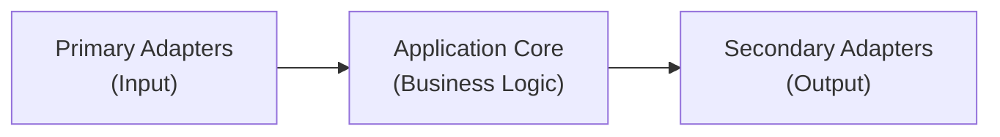

# CloudZero Agent - Application Root

## Documentation Structure

This project uses **hierarchical CLAUDE.md files** to provide structured codebase navigation:

- **Each directory** has a CLAUDE.md explaining its purpose, contents, and testing
- **Follow the hierarchy** - start here, then navigate to subdirectory CLAUDE.md files for details
- **Comprehensive documentation** - The codebase has extensive inline comments, README files, Mermaid diagrams, and architectural documentation
- **Use all available information** - Read source code comments, type definitions, test files, and documentation together for complete understanding

**CRITICAL: All documentation must be kept up-to-date when making code changes.**

## Architecture

CloudZero Agent implements hexagonal (ports and adapters) architecture for cost allocation and monitoring of Kubernetes clusters.



## Directory Structure

### Application Core

- **[types/](./types/CLAUDE.md)** - Interfaces, types, errors (contracts)
- **[domain/](./domain/CLAUDE.md)** - Pure business logic

### Primary Adapters (Input)

- **[handlers/](./handlers/CLAUDE.md)** - HTTP endpoints (Prometheus remote_write, webhooks)
- **[functions/](./functions/CLAUDE.md)** - CLI applications

### Secondary Adapters (Output)

- **[storage/](./storage/CLAUDE.md)** - Data persistence (SQLite, disk)

### Supporting Infrastructure

- **[logging/](./logging/)** - Structured logging
- **[http/](./http/)** - HTTP utilities
- **[utils/](./utils/)** - Common utilities
- **[config/](./config/)** - Configuration management
- **[inspector/](./inspector/)** - Diagnostics

## Testing

```sh
# Test this directory's components
make test GO_TEST_TARGET=./app/...

# Test everything
make test-all
```

## Key Principles

1. **Interfaces first** - Define contracts before implementation
2. **Domain purity** - Business logic has no I/O dependencies
3. **Dependency injection** - Adapters injected into domain services
4. **Fail-open design** - Never block Kubernetes operations
