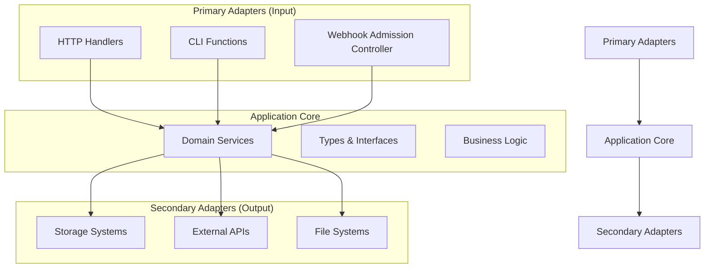
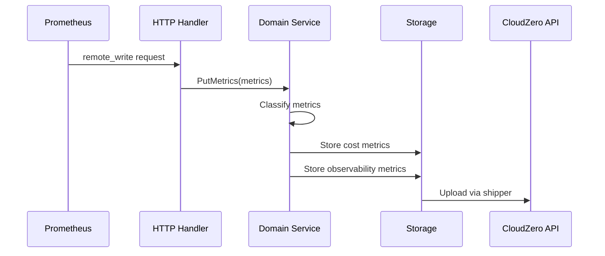

# CloudZero Agent - Application Core

## Overview

The `app/` directory contains the complete application implementation for the CloudZero Agent for Kubernetes, organized using hexagonal architecture principles. This directory implements both the Application Core (domain logic) and the adapters (infrastructure) that enable cost allocation and monitoring for Kubernetes environments.

## Architecture

The CloudZero Agent follows hexagonal (ports and adapters) architecture:

## Directory Structure

### Core Components

- **[types/](./types/)** - Application Core type definitions, interfaces, and error constants
- **[domain/](./domain/)** - Business logic and domain services implementing the core cost allocation pipeline
- **[storage/](./storage/)** - Secondary adapters for persistent data storage (disk, SQLite)

### Primary Adapters (Input Ports)

- **[handlers/](./handlers/)** - HTTP request handlers for Prometheus remote_write and API endpoints
- **[functions/](./functions/)** - CLI applications for agent operations and management
- **[http/](./http/)** - HTTP infrastructure and middleware components

### Supporting Infrastructure

- **[config/](./config/)** - Configuration management and validation systems
- **[logging/](./logging/)** - Structured logging and instrumentation
- **[utils/](./utils/)** - Utility packages for common operations
- **[inspector/](./inspector/)** - Agent diagnostics and monitoring tools

## Data Flow

The CloudZero Agent processes metrics through this flow:

1. **Prometheus** sends remote_write request to **HTTP Handler**
2. **Handler** forwards metrics to **Domain Service**
3. **Domain Service** classifies metrics (cost vs observability)
4. **Domain Service** stores metrics in **Storage**
5. **Storage** uploads data to **CloudZero API** via shipper

## Key Services

### Metric Collection Pipeline

1. **Collection** - Receive Prometheus remote_write requests
2. **Classification** - Separate cost vs observability metrics
3. **Storage** - Buffer metrics to disk with compression
4. **Shipping** - Upload processed data to CloudZero platform

### Webhook System

1. **Admission Control** - Intercept Kubernetes resource creation/updates
2. **Metadata Extraction** - Capture labels and annotations
3. **Storage** - Persist resource metadata for cost attribution
4. **Transmission** - Send metadata to CloudZero for analysis

## Integration Points

### Prometheus Integration

- Remote write protocol (v1 & v2)
- Snappy compression support
- Metric filtering and routing

### Kubernetes Integration

- Admission webhook for resource monitoring
- Support for 15+ resource types
- Label and annotation collection

### CloudZero Platform Integration

- Pre-signed S3 upload URLs
- JSON and Parquet data formats
- Cost allocation API endpoints

## Development Guidelines

### Adding New Components

1. **Identify Layer** - Determine if component is a primary adapter, domain service, or secondary adapter
2. **Define Interfaces** - Add necessary types to `types/` package
3. **Implement Logic** - Place business logic in appropriate domain services
4. **Create Tests** - Ensure comprehensive test coverage
5. **Update Documentation** - Maintain architectural documentation

### Testing Strategy

- **Unit Tests** - Test individual components in isolation
- **Integration Tests** - Test adapter integration with external systems
- **Contract Tests** - Validate interface contracts between layers
- **End-to-End Tests** - Validate complete data flow

## Configuration

The agent supports multiple configuration sources:

- Environment variables
- Configuration files (YAML/JSON)
- Kubernetes ConfigMaps
- CLI parameters

See [config/](./config/) for detailed configuration options.

## Monitoring

The agent provides comprehensive observability:

- Prometheus metrics for collection statistics
- Structured logging with zerolog
- Health check endpoints
- Storage usage monitoring

## Security

- TLS encryption for all external communication
- Certificate management for webhook operations
- Secret management for API credentials
- Input validation and sanitization

## Performance

- Streaming JSON processing for large datasets
- Brotli compression for efficient storage
- Batch processing for optimal throughput
- Memory-efficient metric handling

## Limitations

- Requires persistent storage for metric buffering
- Webhook requires cluster admin permissions
- Network connectivity required for CloudZero uploads
- Memory usage scales with metric ingestion rate

## Opportunities

- Support for additional metric formats
- Enhanced filtering capabilities
- Real-time cost allocation alerts
- Integration with additional monitoring systems
