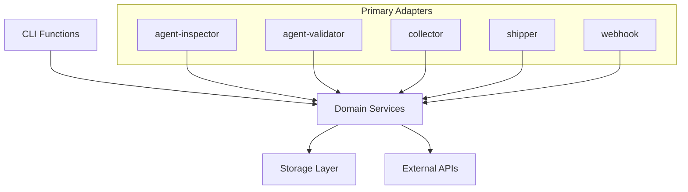

# Functions - CLI Applications

## Overview

The `functions/` directory contains independent command-line applications that support CloudZero Agent operations, management, and diagnostics. Each function is a standalone executable with specific responsibilities in the agent ecosystem.

## Architecture



## CLI Applications

### Core Services

#### [collector/](./collector/) - Metrics Collection Service

**Purpose**: Receives and processes Prometheus remote_write requests

**Key Features**:

- HTTP server for remote_write endpoint
- Metric classification (cost vs observability)
- Streaming JSON compression and storage
- Prometheus protocol v1/v2 support

**Usage**:

```sh
collector --config /etc/agent/config.yaml --port 8080
```

#### [shipper/](./shipper/) - Data Upload Service

**Purpose**: Uploads processed metrics to CloudZero platform

**Key Features**:

- Pre-signed S3 URL management
- Batch uploading with retry logic
- File monitoring and cleanup
- Compression and format conversion

**Usage**:

```sh
shipper --data-dir /data/metrics --api-key-file /secrets/api-key
```

#### [webhook/](./webhook/) - Admission Controller

**Purpose**: Kubernetes admission webhook for resource metadata collection

**Key Features**:

- Validating admission webhook server
- Resource metadata extraction
- Label and annotation processing
- TLS certificate management

**Usage**:

```sh
webhook --cert-dir /certs --port 9443 --tls-cert-file tls.crt --tls-key-file tls.key
```

### Management Tools

#### [agent-validator/](./agent-validator/) - Installation Validation

**Purpose**: Validates agent installation and configuration

**Key Features**:

- Configuration validation
- Connectivity testing
- Permission verification
- Installation diagnostics

**Usage**:

```sh
agent-validator --mode install --config /etc/agent/config.yaml
```

#### [agent-inspector/](./agent-inspector/) - Diagnostics and Monitoring

**Purpose**: Provides runtime diagnostics and performance monitoring

**Key Features**:

- Service health checks
- Storage usage monitoring
- Metric collection statistics
- Configuration inspection

**Usage**:

```sh
agent-inspector --endpoint http://localhost:8080 --output json
```

#### [cluster-config/](./cluster-config/) - Cluster Configuration Management

**Purpose**: Manages cluster-specific configuration and metadata

**Key Features**:

- Cluster information discovery
- Configuration generation
- Cloud provider integration
- Resource quota analysis

**Usage**:

```sh
cluster-config loader --output /etc/agent/cluster.yaml
```

### Utility Tools

#### [certifik8s/](./certifik8s/) - Certificate Management

**Purpose**: Manages TLS certificates for Kubernetes integration

**Key Features**:

- Certificate generation and renewal
- CSR creation and approval
- Integration with cert-manager
- Certificate validation

**Usage**:

```sh
certifik8s --namespace cloudzero --service webhook-service
```

#### [helmless/](./helmless/) - Helm-free Installation

**Purpose**: Enables agent installation without Helm

**Key Features**:

- YAML manifest generation
- Configuration templating
- Resource customization
- Installation validation

**Usage**:

```sh
helmless --config values.yaml --output manifests/
```

#### [scout/](./scout/) - Cloud Resource Discovery

**Purpose**: Discovers and maps cloud provider resources

**Key Features**:

- Multi-cloud support (AWS, GCP, Azure)
- Resource relationship mapping
- Cost allocation preparation
- Metadata enrichment

**Usage**:

```sh
scout --provider aws --region us-west-2 --output resources.json
```

#### [regurgitator/](./regurgitator/) - Multi-Format Metric Transcoding

**Purpose**: Reads metrics from multiple sources and outputs to various destinations

**Key Features**:

- Supports CSV, Parquet, JSON, and JSON.br input formats
- Outputs to files or Prometheus remote_write endpoints
- Fan-out to multiple outputs simultaneously
- HTTP server mode to receive and forward remote_write requests
- Recursive directory processing
- Parallel file readers and writers

**Usage**:

```sh
# Ingest files to remote_write endpoint
regurgitator -o http://mimir:9009/api/v1/push /path/to/metrics/*.parquet

# Convert between formats
regurgitator -o output.parquet input.json.br

# Fan-out to multiple outputs
regurgitator -o output.parquet -o http://mimir:9009/api/v1/push input.csv

# Recursive directory processing
regurgitator -r -o output.json /path/to/metrics/
```

## Common Patterns

### Configuration Management

All functions follow consistent configuration patterns:

```yaml
# Standard configuration structure
server:
  port: 8080
  host: "0.0.0.0"
  tls:
    enabled: true
    cert_file: "/certs/tls.crt"
    key_file: "/certs/tls.key"

storage:
  type: "disk"
  path: "/data"
  max_size: "10GB"

logging:
  level: "info"
  format: "json"

metrics:
  enabled: true
  port: 9090
```

### Command Structure

Functions use Cobra for consistent CLI experience:

```go
var rootCmd = &cobra.Command{
    Use:   "function-name",
    Short: "Brief description",
    Long:  "Detailed description with examples",
    RunE:  runFunction,
}

func init() {
    rootCmd.Flags().StringVar(&configFile, "config", "", "Config file path")
    rootCmd.Flags().IntVar(&port, "port", 8080, "Server port")
    rootCmd.Flags().BoolVar(&debug, "debug", false, "Enable debug logging")
}
```

### Error Handling

Consistent error handling and exit codes:

```go
func main() {
    if err := rootCmd.Execute(); err != nil {
        log.Fatal().Err(err).Msg("Command execution failed")
        os.Exit(1)
    }
}
```

### Health Checks

All long-running services provide health endpoints:

```go
func setupHealthCheck(r *mux.Router) {
    r.HandleFunc("/health", healthHandler)
    r.HandleFunc("/ready", readinessHandler)
    r.HandleFunc("/metrics", promhttp.Handler().ServeHTTP)
}
```

## Development Guidelines

### Adding New Functions

1. **Create directory** with descriptive name
2. **Implement main.go** with Cobra command structure
3. **Add configuration** following standard patterns
4. **Integrate with domain services** for business logic
5. **Add comprehensive tests** including integration tests
6. **Update Helm chart** if function runs as Kubernetes workload

### Function Categories

#### Service Functions

Long-running services that handle ongoing operations:

- collector, shipper, webhook
- Run continuously in Kubernetes
- Provide HTTP endpoints for health/metrics
- Handle graceful shutdown

#### Tool Functions

One-time or periodic execution tools:

- agent-validator

#### Utilities

- scout, regurgitator
- Run as Jobs or CronJobs in Kubernetes
- Exit with appropriate status codes
- Support batch processing

#### Management Functions

Administrative and configuration tools:

- agent-inspector, cluster-config, helmless
- Often run manually or during installation
- Provide rich output and diagnostics
- Support multiple output formats

### Testing Strategy

#### Unit Tests

```go
func TestFunctionLogic(t *testing.T) {
    // Test core function logic
    // Use mocks for external dependencies
    // Focus on business logic validation
}
```

#### Integration Tests

```go
func TestFunctionIntegration(t *testing.T) {
    // Test with real dependencies
    // Use temporary directories/databases
    // Validate end-to-end workflows
}
```

#### CLI Tests

```go
func TestCommandExecution(t *testing.T) {
    // Test command parsing and execution
    // Validate exit codes and output
    // Test error conditions
}
```

## Deployment Patterns

### Kubernetes Deployment

Most functions deploy as Kubernetes workloads:

```yaml
apiVersion: apps/v1
kind: Deployment
metadata:
  name: collector
spec:
  template:
    spec:
      containers:
        - name: collector
          image: cloudzero/agent:latest
          command: ["collector"]
          args: ["--config", "/etc/config/config.yaml"]
          ports:
            - containerPort: 8080
          volumeMounts:
            - name: config
              mountPath: /etc/config
            - name: data
              mountPath: /data
```

### Configuration Injection

Configuration through multiple sources:

```yaml
# ConfigMap for application config
apiVersion: v1
kind: ConfigMap
metadata:
  name: agent-config
data:
  config.yaml: |
    # Application configuration

---
# Secret for sensitive data
apiVersion: v1
kind: Secret
metadata:
  name: agent-secrets
data:
  api-key: <base64-encoded-key>
```

## Monitoring and Observability

### Metrics

All functions expose Prometheus metrics:

```go
var (
    requestsTotal = prometheus.NewCounterVec(
        prometheus.CounterOpts{
            Name: "requests_total",
            Help: "Total number of requests processed",
        },
        []string{"status"},
    )
)
```

### Logging

Structured logging with consistent format:

```go
log := zerolog.New(os.Stdout).With().
    Str("component", "collector").
    Str("version", version).
    Logger()

log.Info().
    Str("operation", "start").
    Int("port", port).
    Msg("Starting server")
```

### Tracing

Distributed tracing for complex workflows:

```go
func processRequest(ctx context.Context, req *Request) error {
    span, ctx := opentracing.StartSpanFromContext(ctx, "process_request")
    defer span.Finish()

    // Process with tracing context
    return nil
}
```

## Security Considerations

### Authentication

- API key management for external services
- Certificate-based authentication for Kubernetes
- Role-based access control (RBAC) permissions

### Data Protection

- TLS encryption for all network communication
- Secret management through Kubernetes secrets
- Input validation and sanitization

### Network Security

- Network policies for pod-to-pod communication
- Service mesh integration where applicable
- Egress control for external API calls
