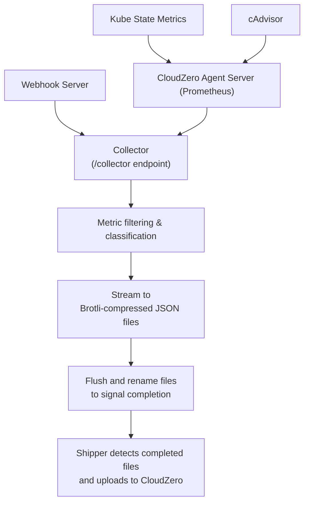

# CloudZero Collector

The CloudZero Collector is a high-performance metrics ingestion service that implements the Prometheus remote_write protocol to collect Kubernetes metrics for cost allocation and observability analysis in the CloudZero platform.

## Overview

The collector serves as the primary entry point for metric data flowing into CloudZero's cost allocation system. It receives metrics from Prometheus servers, other CloudZero agents, and the webhook admission controller, then processes and stores them locally for subsequent transmission to the CloudZero platform.

## Architecture

### Core Components

- **Metric Ingestion**: Prometheus remote_write API endpoint (`/collector`)
- **Protocol Support**: Full compatibility with Prometheus remote_write v1 and v2 protocols
- **Compression**: Automatic handling of Snappy-compressed payloads
- **Metric Classification**: Intelligent filtering of cost vs observability metrics
- **Storage**: Brotli-compressed JSON files with automatic rotation
- **HPA Integration**: Custom metrics API for Kubernetes autoscaling

### Data Flow



## Features

### Prometheus Protocol Compatibility

- **Remote Write v1**: Standard Prometheus remote_write protocol
- **Remote Write v2**: Enhanced protocol with statistics and metadata
- **Content Negotiation**: Automatic detection of compression and serialization formats
- **Load Balancing**: Connection management for distributed collection

### Metric Classification

The collector automatically classifies incoming metrics into two categories:

- **Cost Metrics**: CloudZero-specific metrics for cost allocation and billing analysis
- **Observability Metrics**: Standard Prometheus metrics for monitoring and alerting

### Storage Optimization

- **Brotli Compression**: High-efficiency compression for metric data
- **Automatic Rotation**: Configurable file rotation based on size and time intervals
- **Immediate Flush**: Cost metrics receive priority processing with immediate flush
- **Batch Processing**: Efficient handling of large metric volumes

### Kubernetes Integration

- **Custom Metrics API**: Exposes `czo_cost_metrics_shipping_progress` for HPA autoscaling
- **Health Endpoints**: Kubernetes readiness and liveness probe support
- **Resource Management**: Configurable CPU and memory limits
- **Graceful Shutdown**: Proper cleanup and signal handling

## Configuration

### Configuration File

The collector requires a configuration file specified via the `-config` flag:

```bash
/app/cloudzero-collector -config /path/to/config.yml
```

### Key Configuration Sections

#### Server Configuration

```yaml
server:
  port: 8080 # HTTP server port
  mode: "http" # Server mode (http/https)
  profiling: false # Enable pprof debugging endpoints
```

#### Database/Storage Configuration

```yaml
database:
  storagePath: "/cloudzero/data" # Base storage directory
  maxRecords: 1500000 # Records per file before rotation
  compressionLevel: 8 # Brotli compression level (1-11)
  costMaxInterval: "10m" # Cost metrics flush interval
  observabilityMaxInterval: "30m" # Observability metrics flush interval
```

#### Metrics Configuration

```yaml
metrics:
  cost:
    prefixes: ["czo_", "cloudzero_"] # Cost metric name prefixes
    labels: ["cost_center", "project"] # Required cost labels
  observability:
    prefixes: ["prometheus_", "kube_"] # Observability metric prefixes
    exclude: ["debug_", "test_"] # Excluded metric prefixes
```

#### CloudZero Integration

```yaml
cloudzero:
  host: "api.cloudzero.com" # CloudZero API endpoint
  apiKey: "${CLOUDZERO_API_KEY}" # API key (from environment)
  sendInterval: "10m" # Upload frequency
  sendTimeout: "10s" # API request timeout
```

## API Endpoints

### Primary Endpoints

- **`/collector`**: Prometheus remote_write endpoint (POST)
- **`/metrics`**: Prometheus metrics exposition
- **`/healthz`**: Kubernetes health check endpoint
- **`/debug/pprof/*`**: Profiling endpoints (when enabled)

### Custom Metrics API

The collector exposes a Kubernetes custom metrics API for HPA autoscaling:

```text
/apis/custom.metrics.k8s.io/v1beta1/namespaces/{namespace}/pods/*/czo_cost_metrics_shipping_progress
```

This metric tracks the progress of cost metrics shipping and enables automatic scaling based on metric processing load.

## Deployment

### Helm Chart Integration

The collector is deployed as part of the CloudZero Agent Helm chart in the `aggregator` component:

```yaml
components:
  aggregator:
    enabled: true
    replicas: 1

aggregator:
  collector:
    port: 8080
    resources:
      requests:
        memory: "256Mi"
        cpu: "250m"
      limits:
        memory: "512Mi"
        cpu: "500m"
```

### Container Configuration

```yaml
containers:
  - name: cloudzero-aggregator-collector
    image: ghcr.io/cloudzero/cloudzero-agent:latest
    command:
      ["/app/cloudzero-collector", "-config", "/cloudzero/config/config.yml"]
    ports:
      - containerPort: 8080
    volumeMounts:
      - name: aggregator-config-volume
        mountPath: /cloudzero/config
        readOnly: true
      - name: aggregator-persistent-storage
        mountPath: /cloudzero/data
```

## Development

### Building

```bash
# Build the collector binary
make build

# Build development container image
make package-debug
```

### Testing

```bash
# Run unit tests
make test GO_TEST_TARGET=./app/functions/collector

# Run all tests
make test

# Run integration tests (requires API key)
make test-integration
```

### Local Development

```bash
# Run with local configuration
go run app/functions/collector/main.go -config ./local-config.yml

# Run with environment variables
CLOUDZERO_API_KEY=your-key go run app/functions/collector/main.go -config ./config.yml
```

## Monitoring and Observability

### Metrics Exposed

The collector exposes several Prometheus metrics for monitoring:

- `metrics_received_total`: Total metrics ingested
- `metrics_received_cost_total`: Cost metrics processed
- `metrics_received_observability_total`: Observability metrics processed
- `czo_cost_metrics_shipping_progress`: Shipping progress for HPA

### Health Checks

- **Readiness Probe**: `/healthz` endpoint for Kubernetes readiness checks
- **Liveness Probe**: Health status for Kubernetes liveness monitoring
- **Graceful Shutdown**: Proper cleanup on SIGTERM/SIGINT signals

### Logging

The collector uses structured logging with configurable levels:

```yaml
logging:
  level: "info" # Log level (debug, info, warn, error)
  format: "json" # Log format (json, console)
```

## Troubleshooting

### Common Issues

1. **Configuration File Not Found**

   ```text
   configuration file does not exist
   ```

   - Ensure the `-config` flag points to a valid YAML file
   - Verify file permissions and mount paths

2. **Storage Directory Issues**

   ```text
   failed to initialize database
   ```

   - Check storage volume mount permissions
   - Verify sufficient disk space
   - Ensure directory exists and is writable

3. **API Key Authentication**
   ```text
   failed to validate API key
   ```
   - Verify `CLOUDZERO_API_KEY` environment variable
   - Check API key validity and permissions
   - Ensure network connectivity to CloudZero API

### Debug Mode

Enable debug logging and profiling for troubleshooting:

```yaml
logging:
  level: "debug"

server:
  profiling: true
```

Access profiling data at `/debug/pprof/` endpoints when enabled.

### Health Check Verification

```bash
# Check collector health
curl http://localhost:8080/healthz

# Verify metrics endpoint
curl http://localhost:8080/metrics

# Test custom metrics API
curl http://localhost:8080/apis/custom.metrics.k8s.io/v1beta1/
```

## Performance Considerations

### Throughput Optimization

- **Batch Processing**: Metrics are processed in batches for efficiency
- **Compression**: Brotli compression reduces storage and network overhead
- **Immediate Flush**: Cost metrics are flushed immediately for real-time visibility
- **Background Processing**: File rotation and cleanup run in background goroutines

### Resource Requirements

- **Memory**: Scales with metric batch size and compression buffers
- **CPU**: Brotli compression and JSON processing are CPU-intensive
- **Disk I/O**: High-throughput scenarios require SSD storage
- **Network**: Remote write endpoint handles concurrent connections

### Scaling

- **Horizontal Scaling**: Deploy multiple collector replicas behind a load balancer
- **Vertical Scaling**: Increase CPU/memory limits for high-volume clusters
- **HPA Integration**: Automatic scaling based on metric processing load

## Security

### Network Security

- **Internal Communication**: Designed for internal Kubernetes cluster communication
- **Authentication**: CloudZero API key authentication for data transmission
- **TLS**: Support for HTTPS when configured

### Data Security

- **No Sensitive Data**: Metrics are filtered and processed without storing sensitive information
- **Compression**: Brotli compression reduces data exposure during transmission
- **Temporary Storage**: Local storage is temporary and cleaned up after processing

## Related Components

- **[CloudZero Shipper](../shipper/)**: Uploads processed metrics to CloudZero
- **[CloudZero Webhook](../webhook/)**: Collects Kubernetes resource metadata
- **[CloudZero Agent Validator](../agent-validator/)**: Validates deployment and reports status
- **[Helm Chart](../../../helm/)**: Kubernetes deployment configuration

## Contributing

See the main [CONTRIBUTING.md](../../../CONTRIBUTING.md) file for development guidelines and contribution instructions.

## License

Copyright (c) 2016-2025, CloudZero, Inc. or its affiliates. All Rights Reserved.

Licensed under the Apache License, Version 2.0. See [LICENSE](../../../LICENSE) for details.
