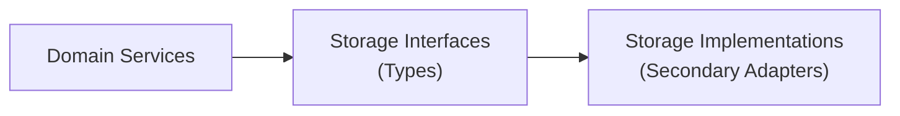

# CloudZero Agent Storage Layer

The storage layer implements Secondary Adapters in CloudZero Agent's hexagonal architecture, providing persistent data storage for Kubernetes resource metadata, operational state, and cost allocation information.

## Architecture Overview



## Core Components

### Repository Pattern

- **Repository Interfaces**: Abstract storage operations defined in `app/types/`
- **Concrete Implementations**: Database-specific implementations in storage packages
- **Transaction Support**: ACID operations for complex multi-table workflows
- **Error Translation**: Database errors mapped to domain-specific error types

### Storage Implementations

#### SQLite Storage (`storage/sqlite/`)

- **Embedded Database**: Zero-configuration local storage
- **Development Support**: Simplified setup for development and testing
- **File-based Persistence**: Reliable data storage without external dependencies
- **Connection Pooling**: Optimized for single-writer, multiple-reader patterns

#### Core Infrastructure (`storage/core/`)

- **Base Repository**: Common repository functionality and transaction management
- **Context Management**: Request-scoped database connections and transactions
- **Error Handling**: Consistent error translation and operational monitoring
- **Migration Support**: Automated schema management and version control

#### Concrete Repositories (`storage/repo/`)

- **ResourceStore**: Kubernetes resource metadata persistence
- **CRUD Operations**: Complete Create, Read, Update, Delete functionality
- **Query Support**: Flexible filtering and searching capabilities
- **Batch Operations**: Efficient bulk data processing

### Data Storage Patterns

#### Resource Metadata Storage

```go
type ResourceTags struct {
    ID          string                 `gorm:"primaryKey"`
    Type        k8s.ResourceType      `gorm:"index"`
    Name        string                `gorm:"index"`
    Namespace   *string               `gorm:"index"`
    Labels      map[string]string     `gorm:"serializer:json"`
    Annotations map[string]string     `gorm:"serializer:json"`
    CreatedAt   time.Time
    UpdatedAt   time.Time
}
```

#### Transaction Management

```go
func (r *Repository) ProcessResourceBatch(ctx context.Context, resources []Resource) error {
    return r.Tx(ctx, func(txCtx context.Context) error {
        for _, resource := range resources {
            if err := r.store.Create(txCtx, resource); err != nil {
                return err // Automatic rollback
            }
        }
        return nil // Automatic commit
    })
}
```

## Database Schema

### Resource Metadata Tables

- **resource_tags**: Core resource metadata and cost allocation labels
- **metric_data**: Processed metric information for cost analysis
- **operational_state**: Agent configuration and runtime state

### Indexing Strategy

- **Type + Namespace + Name**: Fast resource lookup by Kubernetes identity
- **Timestamp**: Efficient temporal queries for cost analysis
- **Labels/Annotations**: JSON field indexing for flexible metadata queries

### Data Retention

- **Resource Metadata**: Retained for cost allocation analysis periods
- **Operational Logs**: Configurable retention based on compliance requirements
- **Metric Data**: Compressed and archived based on CloudZero platform requirements

## Storage Configuration

### SQLite Configuration

```go
// File-based storage for production
db, err := sqlite.NewSQLiteDriver("/data/cloudzero-agent.db")

// In-memory storage for testing
db, err := sqlite.NewSQLiteDriver(sqlite.InMemoryDSN)

// Shared cache for concurrent testing
db, err := sqlite.NewSQLiteDriver(sqlite.MemorySharedCached)
```

### Repository Initialization

```go
func NewResourceRepository(clock types.TimeProvider, db *gorm.DB) (types.ResourceStore, error) {
    // Auto-migrate database schema
    if err := db.AutoMigrate(&types.ResourceTags{}); err != nil {
        return nil, err
    }

    return &resourceRepoImpl{
        clock:        clock,
        BaseRepoImpl: core.NewBaseRepoImpl(db, &resourceRepoImpl{}),
    }, nil
}
```

## Performance Considerations

### Connection Management

- **Connection Pooling**: Optimized for CloudZero Agent usage patterns
- **Transaction Lifecycle**: Proper cleanup and resource management
- **Context Cancellation**: Request cancellation handling for long operations
- **Deadlock Prevention**: Transaction ordering and timeout management

### Query Optimization

- **Prepared Statements**: Automatic statement caching for repeated queries
- **Index Usage**: Strategic indexing for common query patterns
- **Batch Operations**: Bulk insert/update operations for efficiency
- **Query Planning**: GORM query optimization and analysis

### Storage Efficiency

- **JSON Compression**: Efficient storage of metadata and labels
- **Schema Evolution**: Backward-compatible schema changes
- **Data Archival**: Automated cleanup of expired data
- **Disk Usage Monitoring**: Storage utilization tracking and alerting

## Error Handling

### Error Translation

```go
func TranslateError(err error) error {
    if err == nil {
        return nil
    }

    // Map database-specific errors to domain errors
    if errors.Is(err, gorm.ErrRecordNotFound) {
        return types.ErrNotFound
    }

    if isDuplicateKeyError(err) {
        return types.ErrDuplicateKey
    }

    return err
}
```

### Operational Monitoring

- **Storage Metrics**: Prometheus metrics for operation success/failure rates
- **Performance Tracking**: Query latency and throughput monitoring
- **Error Categorization**: Structured error logging for troubleshooting
- **Health Checking**: Database connectivity and performance validation

## Testing Strategies

### Unit Testing

```go
func TestResourceRepository_Create(t *testing.T) {
    // Use in-memory SQLite for fast, isolated tests
    db, err := sqlite.NewSQLiteDriver(sqlite.InMemoryDSN)
    require.NoError(t, err)

    repo, err := repo.NewResourceRepository(&testClock{}, db)
    require.NoError(t, err)

    // Test repository operations
    resource := &types.ResourceTags{...}
    err = repo.Create(context.Background(), resource)
    assert.NoError(t, err)
    assert.NotEmpty(t, resource.ID)
}
```

### Integration Testing

```go
func TestResourceRepository_Integration(t *testing.T) {
    // Use real SQLite file for integration testing
    tmpFile := filepath.Join(t.TempDir(), "test.db")
    db, err := sqlite.NewSQLiteDriver(tmpFile)
    require.NoError(t, err)

    repo, err := repo.NewResourceRepository(utils.NewClock(), db)
    require.NoError(t, err)

    // Test complete workflows
    testCompleteResourceLifecycle(t, repo)
}
```

## Development Patterns

### Repository Implementation

1. **Define Interface**: Add storage interface to `app/types/`
2. **Implement Repository**: Create concrete implementation with GORM
3. **Add Error Handling**: Translate database errors to domain errors
4. **Write Tests**: Comprehensive unit and integration testing
5. **Document Schema**: Update database documentation and migrations

### Transaction Usage

```go
// Use transactions for multi-operation consistency
func (s *Service) UpdateResourceMetadata(ctx context.Context, updates []ResourceUpdate) error {
    return s.repo.Tx(ctx, func(txCtx context.Context) error {
        for _, update := range updates {
            if err := s.repo.Update(txCtx, update); err != nil {
                return err // Automatic rollback
            }
        }
        return nil
    })
}
```

### Query Optimization Examples

```go
// Use proper indexing and query patterns
func (r *resourceRepoImpl) FindByNamespace(ctx context.Context, namespace string) ([]*types.ResourceTags, error) {
    var resources []*types.ResourceTags

    err := r.DB(ctx).
        Where("namespace = ?", namespace).
        Order("created_at DESC").
        Find(&resources).Error

    return resources, core.TranslateError(err)
}
```

## Operational Considerations

### Backup and Recovery

- **SQLite Backup**: File-based backup strategies for SQLite databases
- **Point-in-Time Recovery**: Transaction log replay for data recovery
- **Automated Backups**: Scheduled backup operations with retention policies
- **Disaster Recovery**: Cross-region backup replication strategies

### Monitoring and Alerting

- **Database Health**: Connection pool status and query performance
- **Storage Utilization**: Disk space monitoring and cleanup automation
- **Error Rates**: Storage operation failure tracking and alerting
- **Performance Metrics**: Query latency percentiles and throughput monitoring

### Security

- **Access Control**: Database user permissions and role management
- **Encryption**: Data-at-rest encryption for sensitive information
- **Audit Logging**: Database operation audit trails for compliance
- **Connection Security**: Secure database connections and credential management

## Migration and Schema Evolution

### Schema Versioning

```go
func (db *Database) Migrate() error {
    // GORM auto-migration for development
    if err := db.AutoMigrate(&types.ResourceTags{}); err != nil {
        return fmt.Errorf("auto-migration failed: %w", err)
    }

    return nil
}
```

### Backward Compatibility

- **Additive Changes**: New columns with default values
- **Optional Fields**: Nullable columns for new optional data
- **Data Migration**: Scripts for transforming existing data
- **Version Validation**: Schema version compatibility checking

### Deployment Considerations

- **Zero-Downtime Migration**: Online schema changes without service disruption
- **Rollback Procedures**: Safe rollback of schema changes if needed
- **Testing**: Schema migration testing in staging environments
- **Monitoring**: Migration progress and performance tracking
