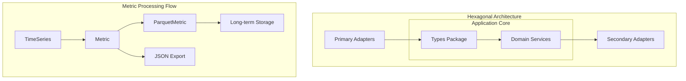

# Types Package - Application Core Contracts

## Overview

The `types` package serves as the foundational layer in the CloudZero Agent's hexagonal architecture, defining all interfaces, data structures, and error constants used throughout the application. This package represents the Application Core contracts that decouple business logic from infrastructure concerns.

## Architecture Role



The types package provides:

- **Interface Contracts** - Define behavior without implementation
- **Data Structures** - Core entities for the domain model
- **Error Definitions** - Typed errors for consistent error handling
- **Type Aliases** - Semantic clarity for common patterns

## Key Components

### Storage Interfaces

#### WritableStore Interface

```go
type WritableStore interface {
    All(context.Context, string) (MetricRange, error)
    Put(context.Context, ...Metric) error
    Flush() error
    Pending() int
}
```

Primary interface for metric storage operations, supporting:

- **Append-only writes** with internal buffering
- **Controlled flushing** for performance optimization
- **Pending monitoring** for storage management

#### ReadableStore Interface

```go
type ReadableStore interface {
    StoreMonitor
    GetFiles(paths ...string) ([]string, error)
    ListFiles(paths ...string) ([]os.DirEntry, error)
    Walk(loc string, process filepath.WalkFunc) error
    Find(ctx context.Context, filterName, filterExtension string) ([]string, error)
}
```

Interface for read-only storage operations with comprehensive file system access.

### Metric Data Structures

#### Core Metric Types

- **Label** - Prometheus-style name/value pairs
- **Sample** - Time series data points with timestamps
- **TimeSeries** - Complete metric series (Prometheus remote_write format)
- **Metric** - Internal CloudZero format with cost allocation metadata
- **ParquetMetric** - Optimized columnar storage format

#### Metric Processing Flow

The flow shown in the architecture diagram above illustrates how metrics are processed:

### Kubernetes Resource Types

#### Resource Constants

- **API Groups** - Core, Apps, Batch, Networking, etc.
- **Resource Kinds** - Pod, Deployment, Service, Node, etc.
- **API Versions** - v1, v1beta1, v1beta2

#### K8sObject Interface

```go
type K8sObject interface {
    metav1.Object
    runtime.Object
}
```

Unified interface for Kubernetes resources in admission webhook processing.

### Storage Monitoring

#### StoreWarning Thresholds

- **None** (< 50%) - Normal operation
- **Low** (50-64%) - Increased monitoring
- **Medium** (65-79%) - Cleanup planning
- **High** (80-89%) - Immediate attention
- **Critical** (90%+) - Emergency response

#### StoreUsage Structure

Comprehensive storage utilization tracking with:

- Total/Available/Used capacity
- Percentage utilization calculation
- Block size information for efficiency analysis

### Lifecycle Management

#### Runnable Interface

```go
type Runnable interface {
    Run() error
    IsRunning() bool
    Shutdown() error
}
```

Standard lifecycle contract for long-running services ensuring:

- **Consistent startup** behavior across components
- **Health monitoring** through status queries
- **Graceful shutdown** with resource cleanup

### Time Abstraction

#### TimeProvider Interface

```go
type TimeProvider interface {
    GetCurrentTime() time.Time
}
```

Enables deterministic testing of time-dependent operations while maintaining real-time behavior in production.

## Error Categories

### General Errors

- **ErrNotFound** - Missing records or resources
- **ErrDuplicateKey** - Constraint violations in storage
- **ErrMultipleItemsFound** - Ambiguous query results

### Validation Errors

- **ErrMissingIndices** - Required index parameters missing
- **ErrInvalidData** - Data format or content validation failures
- **ErrInvalidValueLength** - Length constraint violations

### Operational Errors

- **ErrNotReady** - Component not initialized for operations
- **ErrNotImplemented** - Feature not yet available
- **ErrTableMissing** - Database schema issues

## Usage Patterns

### Interface Implementation

```go
// Secondary adapter implementing storage contract
type DiskStore struct {
    path string
    // ... configuration
}

func (s *DiskStore) Put(ctx context.Context, metrics ...types.Metric) error {
    // Implementation details
}

// Domain service using injected dependencies
type MetricCollector struct {
    costStore types.WritableStore
    obsStore  types.WritableStore
}
```

### Error Handling

```go
// Typed error usage
if err := store.Put(ctx, metrics...); err != nil {
    if errors.Is(err, types.ErrNotReady) {
        // Handle initialization state
    } else if errors.Is(err, types.ErrInvalidData) {
        // Handle validation failure
    }
    return fmt.Errorf("failed to store metrics: %w", err)
}
```

### Metric Conversion

```go
// Convert between formats maintaining data integrity
prometheusData := // ... from remote_write
internalMetric := convertToInternal(prometheusData)
parquetFormat := internalMetric.Parquet()
jsonData := internalMetric.JSON()
```

## Integration Points

### Prometheus Integration

- **TimeSeries** structures match protobuf definitions
- **Label/Sample** types maintain wire format compatibility
- **Metric conversion** preserves all necessary metadata

### CloudZero Platform

- **JSON serialization** follows API specification
- **Parquet format** optimizes analytics storage
- **Metadata structures** support cost allocation algorithms

### Kubernetes API

- **K8sObject** interface handles all supported resources
- **Resource constants** maintain API compatibility
- **Metadata extraction** preserves cost allocation context

## Testing Strategies

### Interface Mocking

```go
// Generate mocks for interfaces
//go:generate mockery --name=WritableStore --case=underscore

func TestDomainLogic(t *testing.T) {
    mockStore := &mocks.WritableStore{}
    mockStore.On("Put", mock.Anything, mock.Anything).Return(nil)

    service := NewService(mockStore)
    // Test without real I/O dependencies
}
```

### Type Validation

```go
func TestMetricConversion(t *testing.T) {
    original := types.Metric{/* ... */}
    parquet := original.Parquet()
    restored := parquet.Metric()

    assert.Equal(t, original, restored)
}
```

## Design Principles

### Dependency Inversion

- High-level modules depend on abstractions
- Storage implementations depend on interfaces
- Domain logic remains infrastructure-agnostic

### Single Responsibility

- Each interface serves one purpose
- Data structures focus on specific domains
- Error types represent specific failure modes

### Open/Closed Principle

- New storage backends implement existing interfaces
- Metric formats extend without breaking existing code
- Resource types add without changing core logic

## Performance Considerations

### Memory Efficiency

- **Streaming interfaces** for large datasets
- **Batch operations** reduce allocation overhead
- **Pool patterns** for frequently used structures

### Serialization Optimization

- **JSON streaming** for large metric collections
- **Parquet columnar** format for analytics queries
- **Protobuf compatibility** with Prometheus ecosystem

## Future Extensions

### New Storage Backends

Implement `types.Store` interface for:

- Cloud storage systems (S3, GCS, Azure)
- Time series databases (InfluxDB, TimescaleDB)
- Message queues (Kafka, NATS)

### Additional Metric Formats

Extend metric types for:

- OpenTelemetry integration
- Custom metric formats
- Enhanced metadata structures

### Enhanced Monitoring

Expand storage monitoring with:

- Performance metrics
- Health check interfaces
- Resource utilization tracking
