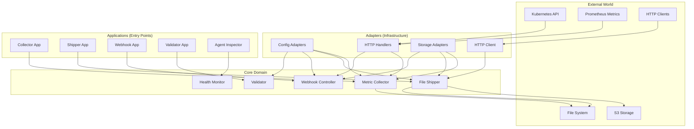
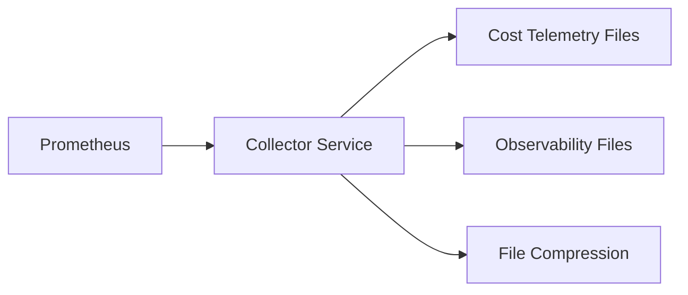
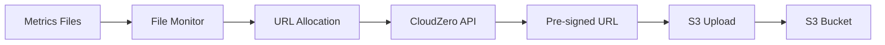
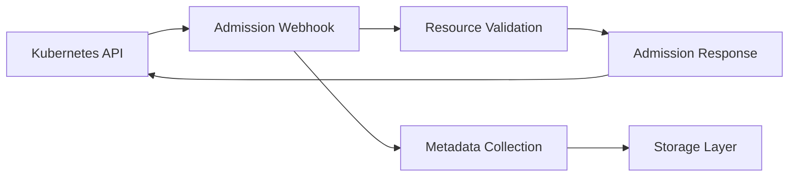
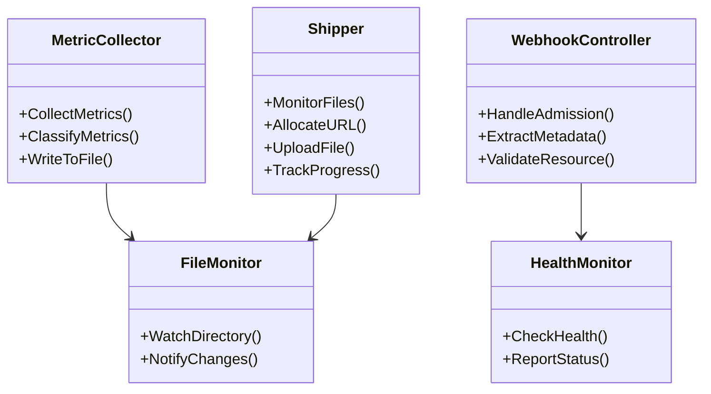
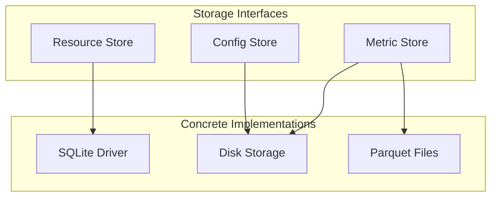
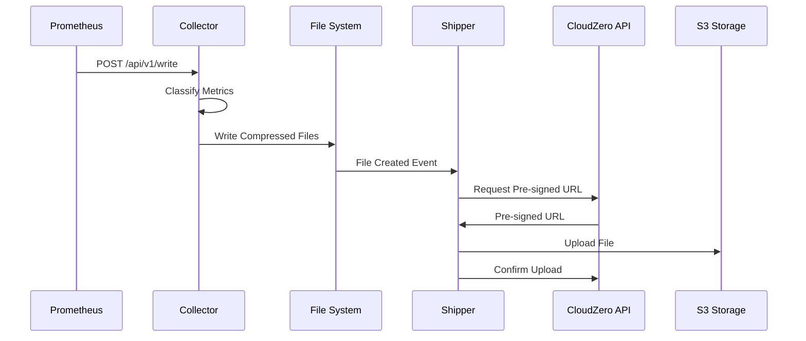
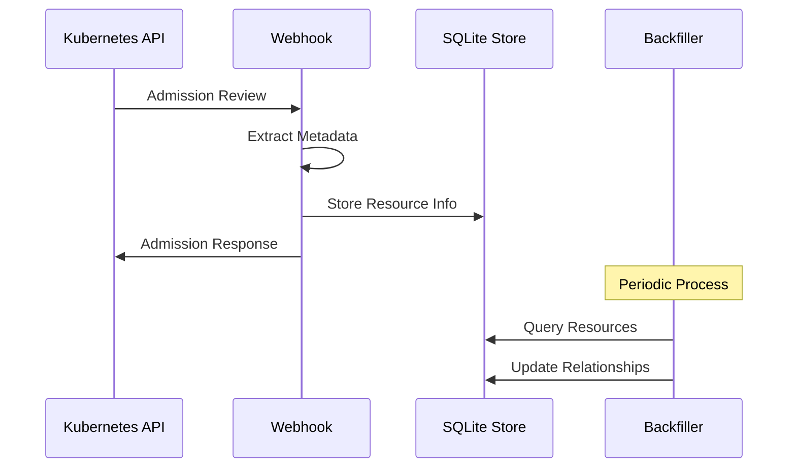
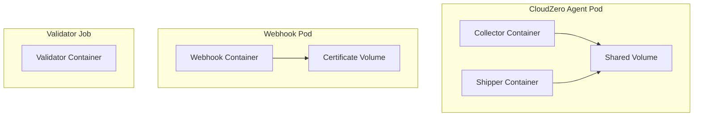
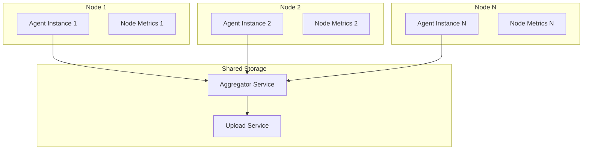

# CloudZero Agent Architecture

## Overview

The CloudZero Agent follows hexagonal architecture principles, separating core business logic from external concerns through well-defined interfaces and adapters. This architecture enables testability, maintainability, and flexibility in deployment scenarios.

## Hexagonal Architecture Overview

## Core Applications (`app/functions/`)

The `app/functions/` directory contains the main applications that serve as entry points into the system. Each application is a standalone binary with specific responsibilities:

### Collector (`app/functions/collector/`)

**Purpose**: Prometheus-compatible metrics collection service

- Implements `/api/v1/write` remote write endpoint
- Classifies and stores metrics in compressed files
- Separates cost telemetry from observability metrics

### Shipper (`app/functions/shipper/`)

**Purpose**: File monitoring and S3 upload service

- Monitors shared locations for metrics files
- Allocates pre-signed S3 URLs via CloudZero API
- Uploads data at configured intervals
- Provides end-to-end file tracking

### Webhook (`app/functions/webhook/`)

**Purpose**: Kubernetes admission controller for resource metadata collection

- ValidatingAdmissionWebhook for Kubernetes resources
- Collects labels, annotations, and relationships
- Supports resource provisioning/deprovisioning tracking

### Agent Validator (`app/functions/agent-validator/`)

**Purpose**: Installation validation and lifecycle management

- Pod lifecycle hook validation
- CloudZero platform status reporting
- Configuration validation

### Additional Tools

- **Agent Inspector** (`app/functions/agent-inspector/`): Debugging and system inspection
- **Helmless** (`app/functions/helmless/`): Configuration analysis and minimal overrides
- **Scout** (`app/functions/scout/`): Cloud provider metadata detection
- **Cluster Config** (`app/functions/cluster-config/`): Configuration loading utilities

## Domain Layer (`app/domain/`)

The domain layer contains the core business logic, isolated from external dependencies:

### Core Domain Services

### Key Domain Components

#### Metric Collection (`app/domain/metric_collector.go`)

- **Responsibility**: Core metrics processing logic
- **Key Operations**: Classification, filtering, compression
- **Interfaces**: Storage abstraction, time provider

#### File Shipping (`app/domain/shipper/`)

- **Responsibility**: File upload orchestration
- **Key Operations**: URL allocation, upload management, error handling
- **Interfaces**: HTTP client, storage, metrics reporting

#### Webhook Processing (`app/domain/webhook/`)

- **Responsibility**: Kubernetes admission control
- **Key Operations**: Resource validation, metadata extraction, backfilling
- **Interfaces**: Kubernetes client, storage, certificate management

#### Health Monitoring (`app/domain/healthz/`)

- **Responsibility**: System health checks
- **Key Operations**: Component status, dependency validation
- **Interfaces**: External service checks

## Adapter Layer

### Configuration Adapters (`app/config/`)

Handles external configuration sources:

- **Gator Settings**: Core configuration management
- **Validator Config**: Validation-specific configuration
- **Webhook Config**: Admission controller configuration

### HTTP Handlers (`app/handlers/`)

External interface adapters:

- **Remote Write**: Prometheus remote write endpoint
- **Webhook**: Kubernetes admission webhook endpoint
- **Metrics**: Prometheus metrics exposition
- **Profiling**: Debug and profiling endpoints

### Storage Adapters (`app/storage/`)

Data persistence abstractions:

#### Storage Implementations

- **SQLite** (`app/storage/sqlite/`): Resource metadata persistence
- **Disk** (`app/storage/disk/`): File-based metrics storage
- **Core** (`app/storage/core/`): Base implementations and patterns

### HTTP Client Adapters (`app/http/`)

External service communication:

- **CloudZero API Client**: Pre-signed URL allocation
- **S3 Upload Client**: File upload operations
- **Middleware**: Request/response processing, retry logic

## Type System (`app/types/`)

Shared types and interfaces that define contracts between layers:

### Core Types

- **Metric**: Prometheus metric representation
- **Resource**: Kubernetes resource metadata
- **Review**: Admission review structures
- **Storage Interfaces**: Repository patterns

### Protocol Buffers

- **Cluster Config**: Configuration message definitions
- **Status Reports**: Health and status reporting

## Infrastructure Utilities (`app/utils/`)

Supporting utilities that don't contain business logic:

- **Clock**: Time abstraction for testing
- **Kubernetes Services**: K8s API helpers
- **Parallel Processing**: Concurrency utilities
- **File Locking**: Resource synchronization
- **Telemetry**: Observability helpers

## Data Flow Architecture

### Metrics Collection Flow

### Webhook Admission Flow

## Deployment Architecture

### Container Structure

### Federated Mode (Large Clusters)

## Design Principles

### Hexagonal Architecture Benefits

1. **Testability**: Core domain isolated from infrastructure
2. **Flexibility**: Easy to swap adapters (SQLite → PostgreSQL)
3. **Maintainability**: Clear separation of concerns
4. **Deployment Options**: Same core, different deployment patterns

### Key Patterns

- **Repository Pattern**: Storage abstraction
- **Adapter Pattern**: External service integration
- **Observer Pattern**: File monitoring and events
- **Strategy Pattern**: Different upload strategies
- **Factory Pattern**: Configuration-driven component creation

### Interface Design

- All external dependencies are behind interfaces
- Domain layer depends only on abstractions
- Adapters implement domain interfaces
- Applications wire dependencies through dependency injection

## Extension Points

### Adding New Metrics Sources

1. Implement new handler in `app/handlers/`
2. Add metric classification logic in domain layer
3. Update collector application wiring

### Adding New Storage Backends

1. Implement storage interfaces in `app/storage/`
2. Add configuration options
3. Update dependency injection in applications

### Adding New Cloud Providers

1. Extend scout utilities in `app/utils/scout/`
2. Add provider-specific configuration
3. Update webhook metadata collection

This architecture enables the CloudZero Agent to handle diverse Kubernetes environments while maintaining clean separation between business logic and infrastructure concerns.
