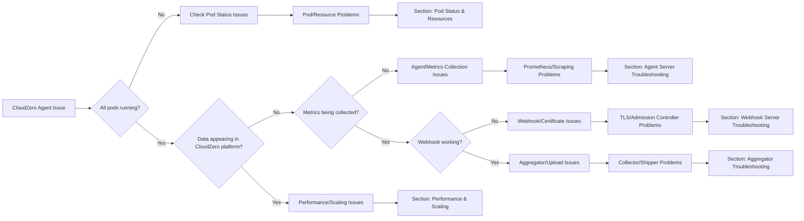

# CloudZero Agent Troubleshooting Guide

This guide provides systematic troubleshooting steps for CloudZero Agent deployment and operation issues. Use the quick diagnosis flowchart to identify the problem area, then follow the component-specific troubleshooting steps.

## Quick Diagnosis Flowchart



## Initial Health Check Commands

Before diving into component-specific troubleshooting, run these quick health checks:

```bash
# Check all pod status
kubectl -n cloudzero-agent get pods -o wide

# Check pod resource usage
kubectl -n cloudzero-agent top pods

# Check for error events
kubectl -n cloudzero-agent get events --sort-by=.metadata.creationTimestamp

# Run validator diagnostics (if agent pod is running)
kubectl -n cloudzero-agent exec -ti -c cloudzero-agent-server <pod-name> -- cat cloudzero-agent-validator.log | jq -r 'select(.checks) | .checks[] | select(.error) | "\(.name): \(.error)"'
```

> 💡 **Tip**: For detailed validation results, see [Deployment Validation Guide](./deploy-validation.md)

---

## Pod Status & Resources

### Common Pod Issues

**Pods in Pending/ImagePullBackOff State:**
```bash
# Check pod details
kubectl -n cloudzero-agent describe pod <pod-name>

# Check image pull secrets
kubectl -n cloudzero-agent get pods <pod-name> -o jsonpath='{.spec.imagePullSecrets}'
```

**Pods Crashing (CrashLoopBackOff):**
```bash
# Check recent logs
kubectl -n cloudzero-agent logs <pod-name> --previous

# Check init container logs
kubectl -n cloudzero-agent logs <pod-name> -c env-validator-run
```

**Resource Issues:**
```bash
# Check resource requests/limits
kubectl -n cloudzero-agent describe pod <pod-name> | grep -A 10 "Limits:\|Requests:"

# Check node capacity
kubectl describe node <node-name> | grep -A 10 "Allocated resources:"
```

---

## Agent Server Troubleshooting

The agent server runs Prometheus and handles metrics collection from Kubernetes.

### Common Issues & Solutions

**❌ Problem: Metrics targets not discovered**
```bash
# Check Prometheus targets
kubectl -n cloudzero-agent port-forward <agent-server-pod> 9090:9090
# Visit http://localhost:9090/targets in browser

# Check kube-state-metrics service
kubectl -n cloudzero-agent get svc cloudzero-agent-cloudzero-state-metrics
kubectl -n cloudzero-agent get endpoints cloudzero-agent-cloudzero-state-metrics
```

**❌ Problem: Remote write failures to aggregator**
```bash
# Check agent logs for remote write errors
kubectl -n cloudzero-agent logs <agent-server-pod> -c cloudzero-agent-server | grep -i "remote_write\|error\|fail"

# Test connectivity to aggregator
kubectl -n cloudzero-agent exec -ti <agent-server-pod> -c cloudzero-agent-server -- wget -O- http://cloudzero-agent-aggregator:8080/healthz
```

**❌ Problem: API key authentication failures**
```bash
# Check API key secret exists
kubectl -n cloudzero-agent get secret cloudzero-agent-api-key

# Verify API key is mounted correctly
kubectl -n cloudzero-agent exec <agent-server-pod> -c cloudzero-agent-server -- ls -la /etc/config/secrets/
```

**❌ Problem: Prometheus configuration errors**
```bash
# Check config reload logs
kubectl -n cloudzero-agent logs <agent-server-pod> -c cloudzero-agent-server | grep -i "reload\|config"

# Validate configuration
kubectl -n cloudzero-agent get configmap cloudzero-agent-configuration -o yaml
```

### Key Log Commands
```bash
# Real-time monitoring
kubectl -n cloudzero-agent logs -f <agent-server-pod> -c cloudzero-agent-server

# Check validator results
kubectl -n cloudzero-agent exec -ti -c cloudzero-agent-server <pod-name> -- cat cloudzero-agent-validator.log | jq

# Check init container validation
kubectl -n cloudzero-agent logs <agent-server-pod> -c env-validator-run
```

---

## Webhook Server Troubleshooting

The webhook server captures Kubernetes resource metadata via admission controllers.

### Common Issues & Solutions

**❌ Problem: Webhook not receiving admission requests**
```bash
# Check webhook configuration
kubectl describe validatingwebhookconfiguration cloudzero-agent-webhook-server-webhook

# Check webhook service endpoints
kubectl -n cloudzero-agent get endpoints cloudzero-agent-webhook-server-svc
```

**❌ Problem: TLS certificate issues**
```bash
# Check certificate status (if using cert-manager)
kubectl -n cloudzero-agent get certificate
kubectl -n cloudzero-agent describe certificate cloudzero-agent-webhook-server-certificate

# Check TLS secret
kubectl -n cloudzero-agent get secret cloudzero-agent-webhook-server-tls -o yaml

# Verify certificate validity
kubectl -n cloudzero-agent get secret cloudzero-agent-webhook-server-tls -o jsonpath='{.data.tls\.crt}' | base64 -d | openssl x509 -text -noout
```

**❌ Problem: Admission timeouts**
```bash
# Check webhook response times
kubectl -n cloudzero-agent logs deployment/cloudzero-agent-webhook-server | grep -i "duration\|timeout"

# Test webhook health directly
curl -k https://cloudzero-agent-webhook-server-svc.cloudzero-agent.svc:443/healthz
```

**❌ Problem: Resource filtering not working**
```bash
# Check webhook configuration for namespaceSelector
kubectl get validatingwebhookconfiguration cloudzero-agent-webhook-server-webhook -o yaml

# Check webhook logs for resource processing
kubectl -n cloudzero-agent logs deployment/cloudzero-agent-webhook-server | grep -i "resource\|admit"
```

### Key Log Commands
```bash
# Monitor admission requests
kubectl -n cloudzero-agent logs -f deployment/cloudzero-agent-webhook-server

# Check for certificate errors
kubectl -n cloudzero-agent logs deployment/cloudzero-agent-webhook-server | grep -i "cert\|tls\|ssl"

# Analyze webhook performance
kubectl -n cloudzero-agent logs deployment/cloudzero-agent-webhook-server | grep -i "latency\|duration"
```

---

## Aggregator Troubleshooting

The aggregator consists of collector (receives metrics) and shipper (uploads to CloudZero).

### Collector Issues

**❌ Problem: Not receiving metrics from agent**
```bash
# Check collector health
kubectl -n cloudzero-agent port-forward deployment/cloudzero-agent-aggregator 8080:8080
curl http://localhost:8080/healthz

# Check collector logs for remote write requests
kubectl -n cloudzero-agent logs deployment/cloudzero-agent-aggregator -c cloudzero-agent-aggregator-collector | grep -i "remote_write\|request"
```

**❌ Problem: Disk space issues**
```bash
# Check persistent volume usage (if using debug container)
kubectl -n cloudzero-agent exec deployment/cloudzero-agent-aggregator -c cloudzero-agent-aggregator-debug -- df -h /cloudzero/data

# Check for disk-related errors
kubectl -n cloudzero-agent logs deployment/cloudzero-agent-aggregator -c cloudzero-agent-aggregator-collector | grep -i "disk\|space\|full"
```

### Shipper Issues

**❌ Problem: S3 upload failures**
```bash
# Check shipper logs for upload errors
kubectl -n cloudzero-agent logs deployment/cloudzero-agent-aggregator -c cloudzero-agent-aggregator-shipper | grep -i "upload\|s3\|error"

# Verify API key for CloudZero platform
kubectl -n cloudzero-agent logs deployment/cloudzero-agent-aggregator -c cloudzero-agent-aggregator-shipper | grep -i "auth\|key\|unauthorized"
```

**❌ Problem: File processing issues**
```bash
# Check for file compression/processing errors
kubectl -n cloudzero-agent logs deployment/cloudzero-agent-aggregator -c cloudzero-agent-aggregator-shipper | grep -i "compress\|parquet\|file"

# Monitor file processing statistics
kubectl -n cloudzero-agent logs deployment/cloudzero-agent-aggregator -c cloudzero-agent-aggregator-shipper | grep -i "processed\|uploaded"
```

### Key Log Commands
```bash
# Monitor collector in real-time
kubectl -n cloudzero-agent logs -f deployment/cloudzero-agent-aggregator -c cloudzero-agent-aggregator-collector

# Monitor shipper uploads
kubectl -n cloudzero-agent logs -f deployment/cloudzero-agent-aggregator -c cloudzero-agent-aggregator-shipper

# Check aggregator metrics (if exposed)
kubectl -n cloudzero-agent port-forward deployment/cloudzero-agent-aggregator 8081:8081
curl http://localhost:8081/metrics
```

---

## Supporting Components

### Kube-State-Metrics Issues

**❌ Problem: Service not reachable**
```bash
# Check kube-state-metrics pod
kubectl -n cloudzero-agent get pods -l app.kubernetes.io/name=kube-state-metrics

# Test metrics endpoint
kubectl -n cloudzero-agent port-forward svc/cloudzero-agent-cloudzero-state-metrics 8080:8080
curl http://localhost:8080/metrics | head -20
```

### Job Failures

**❌ Problem: Backfill job failed**
```bash
# Check backfill job logs
kubectl -n cloudzero-agent logs job/<backfill-job-name>

# Check job status
kubectl -n cloudzero-agent describe job/<backfill-job-name>
```

**❌ Problem: Certificate initialization failed**
```bash
# Check init-cert job
kubectl -n cloudzero-agent logs job/<init-cert-job-name>

# Verify certificates were created
kubectl -n cloudzero-agent get secrets | grep tls
```

---

## Network & Security Issues

### Network Policy Problems

Network policies can block communication between components or external endpoints.

**Diagnosis:**
```bash
# Check for network policies
kubectl -n cloudzero-agent get networkpolicies

# Test connectivity between components
kubectl -n cloudzero-agent exec <agent-server-pod> -- nc -zv cloudzero-agent-aggregator 8080
kubectl -n cloudzero-agent exec <webhook-pod> -- nc -zv cloudzero-agent-aggregator 8080
```

**Common Solutions:**
- Ensure egress rules allow communication to CloudZero S3 buckets
- Verify inter-namespace communication is allowed
- Check service mesh sidecar interference

### Firewall & Egress Issues

**Required External Endpoints:**
- CloudZero API endpoints (varies by environment)
- S3 bucket access for uploads
- Container registry access for image pulls

```bash
# Test external connectivity from cluster
kubectl run test-connectivity --rm -i --tty --image=nicolaka/netshoot -- /bin/bash
# Then test: curl -v https://api.cloudzero.com/healthz
```

---

## Performance & Scaling Issues

### Large Cluster Optimization

**Symptoms:**
- High memory usage on agent server
- Slow webhook response times
- Aggregator falling behind on uploads

**Solutions:**

1. **Enable Federated Mode:**
   ```yaml
   server:
     agentMode: true  # Enable federated/daemonset mode
   ```

2. **Scale Aggregator:**
   ```yaml
   components:
     aggregator:
       replicas: 5  # Increase from default 3
   ```

3. **Tune Resource Limits:**
   ```yaml
   server:
     resources:
       requests:
         memory: "2Gi"
         cpu: "1000m"
       limits:
         memory: "4Gi"
         cpu: "2000m"
   ```

### Monitoring Performance
```bash
# Check resource usage
kubectl -n cloudzero-agent top pods

# Monitor webhook latency
kubectl -n cloudzero-agent logs deployment/cloudzero-agent-webhook-server | grep -E "duration|latency" | tail -20

# Check aggregator queue depth
kubectl -n cloudzero-agent logs deployment/cloudzero-agent-aggregator -c cloudzero-agent-aggregator-shipper | grep -i "queue\|pending"
```

---

## Escalation & Support

### When to Escalate

Contact CloudZero support (support@cloudzero.com) when:

- ✅ No data appears in CloudZero platform after **10+ minutes** with healthy pods
- ✅ Persistent certificate issues despite following TLS troubleshooting
- ✅ Performance problems in large clusters (>500 nodes) after scaling optimizations
- ✅ Suspected platform/service-side issues

### Information to Provide

When contacting support, include:

1. **Cluster Information:**
   ```bash
   kubectl version
   kubectl get nodes -o wide
   kubectl -n cloudzero-agent get pods -o wide
   ```

2. **Configuration:**
   - Helm values used for installation
   - Any custom network policies
   - Service mesh configuration (if applicable)

3. **Diagnostic Data:**
   ```bash
   # Generate comprehensive diagnostic bundle
   kubectl -n cloudzero-agent exec -ti -c cloudzero-agent-server <pod-name> -- cat cloudzero-agent-validator.log > validator-diagnostics.log
   kubectl -n cloudzero-agent describe all > pod-descriptions.txt
   kubectl -n cloudzero-agent get events --sort-by=.metadata.creationTimestamp > events.txt
   ```

4. **Recent Logs:** 
   - Include logs from all relevant components (last 100-200 lines)
   - Timestamps of when issues started occurring

### Self-Service Resources

- 📖 [Installation FAQ](https://github.com/Cloudzero/cloudzero-agent/wiki/Installation-FAQ)
- 🔍 [Deployment Validation Guide](./deploy-validation.md)
- 📊 [CloudZero Documentation](https://docs.cloudzero.com/)
- 🐛 [GitHub Issues](https://github.com/Cloudzero/cloudzero-agent/issues)

---

## Common Error Patterns

### Quick Reference for Log Analysis

**Agent Server Patterns:**
```bash
# Scrape failures
kubectl logs <pod> -c cloudzero-agent-server | grep -E "dial|connection refused|timeout"

# Remote write issues  
kubectl logs <pod> -c cloudzero-agent-server | grep -E "remote_write.*error|failed to send"

# Config problems
kubectl logs <pod> -c cloudzero-agent-server | grep -E "config.*error|failed to reload"
```

**Webhook Patterns:**
```bash
# Certificate issues
kubectl logs deployment/cloudzero-agent-webhook-server | grep -E "tls|certificate|x509"

# Admission failures
kubectl logs deployment/cloudzero-agent-webhook-server | grep -E "admission.*denied|webhook.*failed"
```

**Aggregator Patterns:**
```bash
# Upload failures
kubectl logs deployment/cloudzero-agent-aggregator -c cloudzero-agent-aggregator-shipper | grep -E "upload.*failed|s3.*error"

# Processing issues
kubectl logs deployment/cloudzero-agent-aggregator -c cloudzero-agent-aggregator-collector | grep -E "decode.*error|write.*failed"
```

---

*For additional help, visit the [CloudZero Documentation](https://docs.cloudzero.com/) or contact [support@cloudzero.com](mailto:support@cloudzero.com)*