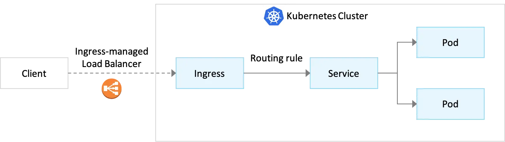
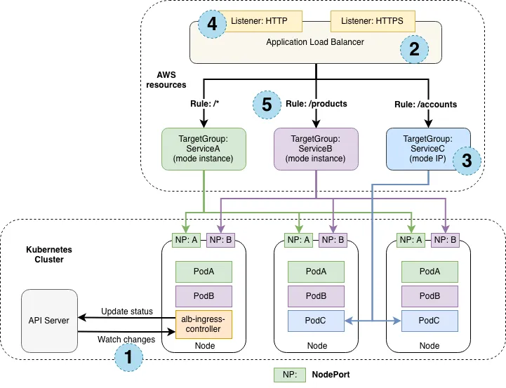

# Kubernetes Ingress — AWS EKS Cluster with AWS Load Balancer Controller

To achieve unit cost visibility for your platform applications, it is essential to allocate network costs accurately to the workloads running within your Kubernetes environments. Network cost allocation involves identifying and attributing the costs associated with data transfer, ingress, egress, and inter-service communication to the specific workloads or teams utilizing these resources.

By leveraging Kubernetes metadata, such as namespaces, labels, and annotations, along with cloud provider billing data, you can map network usage to individual workloads. This enables you to:

- **Understand Network Traffic Patterns**: Gain insights into how workloads communicate and the volume of data being transferred.
- **Allocate Costs Fairly**: Attribute network costs to the appropriate teams or services based on actual usage.
- **Optimize Network Usage**: Identify high-cost traffic patterns and optimize them to reduce expenses.
- **Improve Accountability**: Provide teams with visibility into their network consumption and associated costs, encouraging cost-conscious behavior.

Tools like the AWS Cost and Usage Report (CUR) and CloudZero Kubernetes monitoring solution can help you correlate network usage with workload metadata. This approach ensures that your teams have a clear understanding of their network-related expenses, enabling better cost management and decision-making.

[**Kubernetes Ingress**](https://kubernetes.io/docs/concepts/services-networking/ingress/) is Kubernetes network object that manages external access to Services within a Kubernetes Cluster. It provides HTTP and HTTPS routes from outside the Cluster to Services inside it, with traffic routing controlled by rules defined in the Ingress resource.



**Amazon Elastic Load Balancer (ALB)** is a widely used AWS service that operates at the application layer (Layer 7) to distribute incoming traffic across multiple targets, such as Amazon EC2 instances, within a region. ALB offers advanced features like host-based and path-based routing, TLS (Transport Layer Security) termination, WebSockets, HTTP/2, AWS WAF (Web Application Firewall) integration, access logs, and health checks.

When using **AWS Application Load Balancer (ALB)** with Kubernetes Ingress, or Services, costs will be incurred which need to be attributed to the worksload which is serves.

> **Note**: Enabling features like SSL termination and cross-zone load balancing may incur additional costs. Always refer to the [AWS pricing documentation](https://aws.amazon.com/pricing/) for the latest details and regional variations.

The open-source [AWS ALB Ingress Controller](https://github.com/kubernetes-sigs/aws-alb-ingress-controller) automates the creation of an ALB and its associated AWS resources whenever a Kubernetes user defines an Ingress resource in the Cluster. This integration allows the ALB to route HTTP(S) traffic to various endpoints within the Cluster. The AWS ALB Ingress Controller is compatible with any Kubernetes Cluster, including Amazon Elastic Kubernetes Service (Amazon EKS).

An Ingress can provide externally-reachable URLs, load balance traffic, terminate SSL/TLS, and enable name-based virtual hosting. An Ingress controller fulfills the Ingress resource, typically using a Load Balancer, though it may also configure edge routers or other frontends to handle traffic.

## Difference Between Ingress and Service

Kubernetes Services abstract the exposure of applications running on Pods as network services. For some parts of an application (e.g., frontends, public APIs), you may need to expose a Service to an external IP address outside the Kubernetes Cluster. In Kubernetes, both **Ingress** and **Service** are used to manage network traffic, but they address different traffic patterns and use cases:

- **Service**: A Service facilitates **East-West traffic** within the cluster by providing stable networking for Pods. It abstracts a logical set of Pods and defines policies for accessing them. Service types include:
    * `ClusterIP`: Handles internal cluster communication.
    * `NodePort`: Exposes the Service on each Node's IP and a static port.
    * `LoadBalancer`: Integrates with cloud provider load balancers for external access.
    * `ExternalName`: Maps the Service to an external DNS name.

* **Ingress**: An Ingress manages **North-South traffic**, enabling external HTTP and HTTPS access to Services. It consolidates multiple routing rules into a single resource, allowing external clients to access cluster Services through a unified IP address or hostname. Ingress supports advanced features like SSL termination, path-based routing, and host-based routing.

Thus, a **Service** routes traffic to Pods within the cluster (East-West), while an **Ingress** provides external access to Services (North-South) with enhanced routing capabilities.

## Ingress Controller

For Ingress (and Service) resources to work, the Cluster must have an Ingress Controller. The Ingress Controller implements the Kubernetes Ingress API, processes Ingress resource data, and configures an HTTP Load Balancer accordingly. Below is an example of an Ingress resource:

***Please note, Ingress Controllers can configure software Load Balancers within the Cluster or external hardware/Cloud Load Balancers. Different Load Balancers require specific Ingress Controller implementations.***.

```yaml
apiVersion: networking.k8s.io/v1
kind: Ingress
metadata:
 name: {NAME}
 namespace: {NAMESPACE}
spec:
 rules:
   - host: {host}
     http:
       paths:
         - path: /*
           pathType: Prefix
           backend:
             service:
               name: {SERVICE}
               port:
                 number: 8080
```


## AWS Ingress Controller

## AWS Ingress Controller Project

The [AWS Ingress Controller project](https://kubernetes-sigs.github.io/aws-load-balancer-controller/latest/) is an open-source initiative that integrates Kubernetes Ingress resources with AWS Load Balancers, providing seamless management of Application Load Balancers (ALBs) and Network Load Balancers (NLBs) for Kubernetes workloads. This project ensures tight integration between Kubernetes and AWS networking services, simplifying the deployment and management of scalable, secure, and cost-effective applications.

### Key Features

- **Automatic Resource Provisioning**: Dynamically creates and manages AWS Load Balancers, Target Groups, Listeners, and Rules based on Kubernetes Ingress definitions.
- **Advanced Routing**: Supports path-based and host-based routing for HTTP(S) traffic, enabling fine-grained traffic management.
- **SSL/TLS Termination**: Simplifies secure communication by managing SSL certificates.
- **Cost Efficiency**: Allows sharing of ALBs across multiple Ingress rules using annotations, reducing costs and simplifying configuration.
- **Direct Pod Routing**: Routes traffic directly to Pods, bypassing kube-proxy for improved performance and reduced latency.

### Benefits of AWS Load Balancer Controller

The **AWS Load Balancer Controller** (formerly known as the AWS ALB Ingress Controller) manages AWS Load Balancers for Kubernetes Clusters. It provisions:

- An ALB for Kubernetes Ingress resources, enabling advanced routing rules and centralized configuration.
- An NLB for Kubernetes Services of type LoadBalancer, supporting IP targets on Amazon EKS clusters running Kubernetes 1.18 or later.

By leveraging the AWS Load Balancer Controller, you can consolidate multiple Services under a single entry point, enabling cost-efficient and scalable traffic management. It supports ingress path-based routing and direct routing to Pods, bypassing internal service IPs and kube-proxy for enhanced performance.

This integration simplifies the deployment of Kubernetes workloads on AWS, providing dynamic provisioning and configuration of ALBs and NLBs for both **Kubernetes Ingress** and **Service** object types. It ensures seamless traffic management, advanced routing capabilities, and secure communication for your applications.



### How the AWS Load Balancer Controller Works

This section describes each step (circle) above. This example demonstrates satisfying 1 ingress resource.

**[1]**: The controller watches for [ingress
events](https://kubernetes.io/docs/concepts/services-networking/ingress/#ingress-controllers) from the API server. When it
finds ingress resources that satisfy its requirements, it begins the creation of AWS resources.

**[2]**: An
[ALB](https://docs.aws.amazon.com/elasticloadbalancing/latest/application/introduction.html) (ELBv2) is created in AWS for the new ingress resource. This ALB can be internet-facing or internal. You can also specify the subnets it's created in
using annotations.

**[3]**: [Target Groups](http://docs.aws.amazon.com/elasticloadbalancing/latest/application/load-balancer-target-groups.html) are created in AWS for each unique Kubernetes service described in the ingress resource.

**[4]**: [Listeners](http://docs.aws.amazon.com/elasticloadbalancing/latest/application/load-balancer-listeners.html) are created for every port detailed in your ingress resource annotations. When no port is specified, sensible defaults (`80` or `443`) are used. Certificates may also be attached via annotations.

**[5]**: [Rules](http://docs.aws.amazon.com/elasticloadbalancing/latest/application/listener-update-rules.html) are created for each path specified in your ingress resource. This ensures traffic to a specific path is routed to the correct Kubernetes Service.

Along with the above, the controller also...

- deletes AWS components when ingress resources are removed from k8s.
- modifies AWS components when ingress resources change in k8s.
- assembles a list of existing ingress-related AWS components on start-up, allowing you to
  recover if the controller were to be restarted.

## Sharing an ALB Across Multiple Ingress Rules

Before version 2.0, each Kubernetes Ingress object created its own ALB. To reduce costs and simplify configuration, the AWS Load Balancer Controller allows sharing a single ALB across multiple Services and Namespaces using the `alb.ingress.kubernetes.io/group.name` annotation. All Services within the same group share the same Load Balancer.

> [See AWS EKS Blog: Route internet traffic with AWS Load Balancer Controller](https://docs.aws.amazon.com/eks/latest/userguide/aws-load-balancer-controller.html)


Example configuration:

```yaml
apiVersion: networking.k8s.io/v1
kind: Ingress
metadata:
 name: {NAME}
 namespace: {NAMESPACE}
  annotations:
    kubernetes.io/ingress.class: alb
    #Share a single ALB with all Ingress rules with a specific group name
    alb.ingress.kubernetes.io/group.name: {GROUP_NAME}
    alb.ingress.kubernetes.io/target-type: instance
    alb.ingress.kubernetes.io/scheme: internet-facing
    alb.ingress.kubernetes.io/certificate-arn: {CERTIFICATE}
    alb.ingress.kubernetes.io/listen-ports: '[{"HTTPS":443}]'
    alb.ingress.kubernetes.io/actions.ssl-redirect: '{"Type": "redirect", "RedirectConfig": { "Protocol": "HTTPS", "Port": "443", "StatusCode": "HTTP_301"}}'
spec:
 rules:
   - host: {host}
     http:
       paths:
         - path: /*
           pathType: Prefix
           backend:
             service:
               name: {SERVICE}
               port:
                 number: 8080
```

### Summary

The Kubernetes Ingress API streamlines the process of exposing applications in a Kubernetes Cluster to the Internet by consolidating routing rules into a single resource. To utilize Ingress, an Ingress Controller must be configured to process Ingress resources and manage traffic effectively. In AWS EKS Clusters, the AWS Load Balancer Controller enables sharing a single Application Load Balancer (ALB) across multiple Ingress rules using the `alb.ingress.kubernetes.io/group.name` annotation. These resources incur costs, but with the CloudZero Agent, you can capture telemetry data to accurately allocate the associated network costs back to the pods and relevant cost dimensions for these resources.

---

## Deploying the AWS Load Balancer Controller, and an Example Application

### 1. Configure IAM

The controller runs on the worker nodes, so it needs access to the AWS ALB/NLB APIs with IAM permissions.

The IAM permissions can either be setup using [IAM roles for service accounts (IRSA)](https://docs.aws.amazon.com/eks/latest/userguide/iam-roles-for-service-accounts.html) or can be attached directly to the worker node IAM roles. The best practice is using IRSA if you're using Amazon EKS. If you're using kOps or self-hosted Kubernetes, you must manually attach polices to node instances.

### Defining IAM roles for service accounts (IRSA)

The reference IAM policies contain the following permissive configuration:
```
{
    "Effect": "Allow",
    "Action": [
        "ec2:AuthorizeSecurityGroupIngress",
        "ec2:RevokeSecurityGroupIngress"
    ],
    "Resource": "*"
},
```

We recommend further scoping down this configuration based on the VPC ID or cluster name resource tag.

Example condition for VPC ID:
```
    "Condition": {
        "ArnEquals": {
            "ec2:Vpc": "arn:aws:ec2:<REGION>:<ACCOUNT-ID>:vpc/<VPC-ID>"
        }
    }
```

Example condition for cluster name resource tag:
```
    "Condition": {
        "Null": {
            "aws:ResourceTag/kubernetes.io/cluster/<CLUSTER-NAME>": "false"
        }
    }
```

#### 1. Create an IAM OIDC provider. You can skip this step if you already have one for your cluster.

```sh
eksctl utils associate-iam-oidc-provider \
    --region <region-code> \
    --cluster <your-cluster-name> \
    --approve
```

#### 2.Download an IAM policy for the LBC using one of the following commands:

```sh
curl -o iam-policy.json https://raw.githubusercontent.com/kubernetes-sigs/aws-load-balancer-controller/v2.12.0/docs/install/iam_policy.json
```

#### 3. Create an IAM policy named `AWSLoadBalancerControllerIAMPolicy`. If you downloaded a different policy, replace `iam-policy` with the name of the policy that you downloaded.

```sh
aws iam create-policy \
    --policy-name AWSLoadBalancerControllerIAMPolicy \
    --policy-document file://iam-policy.json
```

```json
{
    "Policy": {
        "PolicyName": "AWSLoadBalancerControllerIAMPolicy",
        "PolicyId": "ANPA6GH2OCFRIWF2FURSR",
        "Arn": "arn:aws:iam::975482786146:policy/AWSLoadBalancerControllerIAMPolicy",
        "Path": "/",
        "DefaultVersionId": "v1",
        "AttachmentCount": 0,
        "PermissionsBoundaryUsageCount": 0,
        "IsAttachable": true,
        "CreateDate": "2025-04-24T00:47:52+00:00",
        "UpdateDate": "2025-04-24T00:47:52+00:00"
    }
}
```

**Take note of the policy ARN that's returned.**

#### 4. Create an IAM role and Kubernetes `ServiceAccount` for the LBC. Use the ARN from the previous step.

```
eksctl create iamserviceaccount \
--cluster=<cluster-name> \
--namespace=kube-system \
--name=aws-load-balancer-controller \
--attach-policy-arn=arn:aws:iam::<AWS_ACCOUNT_ID>:policy/AWSLoadBalancerControllerIAMPolicy \
--override-existing-serviceaccounts \
--region <region-code> \
--approve
```

eksctl create iamserviceaccount \
--cluster=aws-cirrus-jb-cluster \
--namespace=kube-system \
--name=aws-load-balancer-controller \
--attach-policy-arn=arn:aws:iam::975482786146:policy/AWSLoadBalancerControllerIAMPolicy \
--override-existing-serviceaccounts \
--region us-east-2 \
--approve


### 1. Deploy the AWS ALB Ingress Controller

1. **Add the EKS chart repo to Helm**

    ```sh
    helm repo add eks https://aws.github.io/eks-charts
    ```
    > **TIP:**
    > If **upgrading** the chart via helm upgrade, install the `TargetGroupBinding` CRDs.
    >
    > `wget https://raw.githubusercontent.com/aws/eks-charts/master/stable/aws-load-balancer-controller/crds/crds.yaml`
    > 
    > `kubectl apply -f crds.yaml`
    >
    > The helm install command automatically applies the CRDs, but helm upgrade doesn't.

1. **Helm install command for clusters with IRSA:**

    ```sh

    helm install aws-load-balancer-controller eks/aws-load-balancer-controller -n kube-system --set clusterName=<cluster-name> --set serviceAccount.create=false --set serviceAccount.name=aws-load-balancer-controller
    ```

2. **Verify that the deployment was successful and the controller started**

    ```sh
    $  kubectl get po -n kube-system
    ```


### 2. Deploy a Sample Application

Now let’s deploy a sample [2048 game](https://gabrielecirulli.github.io/2048/) into our Kubernetes cluster and use the Ingress resource to expose it to traffic.

1. **Deploy 2048 game resources**
    ```sh
    kubectl apply -f https://raw.githubusercontent.com/kubernetes-sigs/aws-load-balancer-controller/refs/heads/release-2.12/docs/examples/2048/2048_full.yaml
    ```

2. **After few seconds, verify that the Ingress resource is enabled:**
    ```sh
    $ kubectl get ingress/ingress-2048 -n game-2048
    NAME           CLASS   HOSTS   ADDRESS                                                                   PORTS   AGE
    ingress-2048   alb     *       k8s-game2048-ingress2-01278469b7-2090856886.us-east-2.elb.amazonaws.com   80      5s
    ```

3. _**Open a browser and copy-paste your DNS-Name-Of-Your-ALB to play your newly deployed 2048 game – have fun!**_

    eg. open http://k8s-game2048-ingress2-01278469b7-2090856886.us-east-2.elb.amazonaws.com/

---

## How CloudZero Agent Network Telemetry Identification

The CloudZero Agent must collect metadata:
* cloudzero-agent (validating webhook) collects 
* cloudzero-agent (cadvisor exporter) collects
* cloudzero-agent (iptable exporter) collects
---

## CloudZero Cost Allocation Demo
TBD


## References

* [Kubernetes Ingress with AWS ALB Ingress Controller](https://aws.amazon.com/blogs/opensource/kubernetes-ingress-aws-alb-ingress-controller/)
* [AWS Load Balancer Controller Installation](https://kubernetes-sigs.github.io/aws-load-balancer-controller/latest/deploy/installation/#configure-iam)
